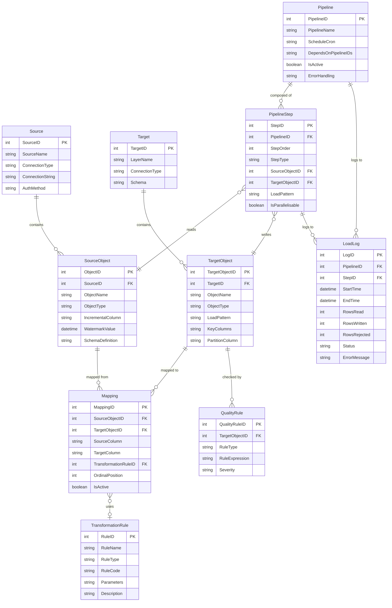
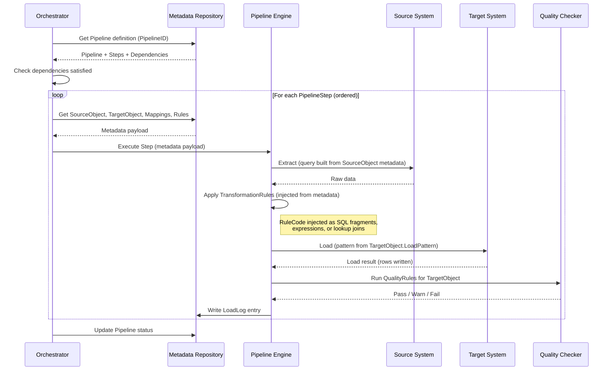

# Metadata-Driven Pipeline Framework Reference

## Core Concept

A metadata-driven pipeline framework separates **what** to do (metadata) from **how** to do it (engine). This makes the system:

- **Extensible**: Adding a new source = adding metadata rows, not writing new code
- **Auditable**: Every execution is logged against its metadata definition
- **Testable**: Metadata can be validated before execution
- **Portable**: The same metadata can drive different engines (ADF, Spark, dbt, SSIS, Airflow, etc.)

## Metadata Repository — Entity Relationship



## Generic Pipeline Engine — Execution Flow



## Transformation Rule Types

| RuleType | RuleCode Example | Injection Point |
|---|---|---|
| `DirectCopy` | (none) | Column mapped 1:1 |
| `SQL` | `UPPER(TRIM({source_column}))` | Injected into SELECT clause |
| `Expression` | `{col_a} * {col_b} / 100` | Computed column in SELECT |
| `Lookup` | `ref_table:code_column:description_column` | LEFT JOIN injected into FROM clause |
| `Conditional` | `CASE WHEN {status}='A' THEN 'Active' ELSE 'Inactive' END` | CASE expression in SELECT |
| `Aggregate` | `SUM({amount}) GROUP BY {category}` | Aggregate query pattern |
| `Custom` | `custom_function_name(params)` | UDF / stored procedure call |
| `HashKey` | `HASH({bk1}, {bk2})` | Hash computation for Data Vault |
| `SurrogateKey` | `NEXT_SEQUENCE('dim_seq')` | Key generation |

## Load Pattern Templates

### Full Load
```
TRUNCATE target_table;
INSERT INTO target_table (columns)
SELECT mapped_columns_with_transformations
FROM source_query;
```

### Incremental (Watermark)
```
SELECT mapped_columns_with_transformations
FROM source_query
WHERE incremental_column > @last_watermark;

INSERT INTO target_table ...;
UPDATE metadata SET WatermarkValue = @max_incremental_value;
```

### SCD2 Merge
```
-- See kb-scd-fact-patterns.md for full pseudocode
MERGE target USING source ON business_key
WHEN MATCHED AND hash_diff_changed THEN expire + insert new version
WHEN NOT MATCHED THEN insert new row
WHEN NOT MATCHED BY SOURCE THEN soft-delete (optional)
```

### Upsert (SCD1/Merge)
```
MERGE target USING source ON business_key
WHEN MATCHED THEN UPDATE SET columns = source.columns
WHEN NOT MATCHED THEN INSERT (columns) VALUES (source.columns)
```

## Adding a New Data Source — Metadata-Only Workflow

To onboard a new source table into the framework:

1. **Register Source** (if new system): Insert into `Source` table
2. **Register SourceObject**: Insert table/file definition with schema and incremental column
3. **Register TargetObject**: Define where it lands in each layer (L0, L1, L2) with load patterns
4. **Define Mappings**: Column-level mappings with transformation rules
5. **Create/Reuse TransformationRules**: Add any new rules, reuse existing ones by ID
6. **Define QualityRules**: Post-load checks for the new target objects
7. **Add PipelineSteps**: Insert steps into existing or new pipeline
8. **Test**: Execute pipeline in dry-run mode → validate metadata → run with data

**Zero new code required.** The generic engine reads the metadata and executes accordingly.
