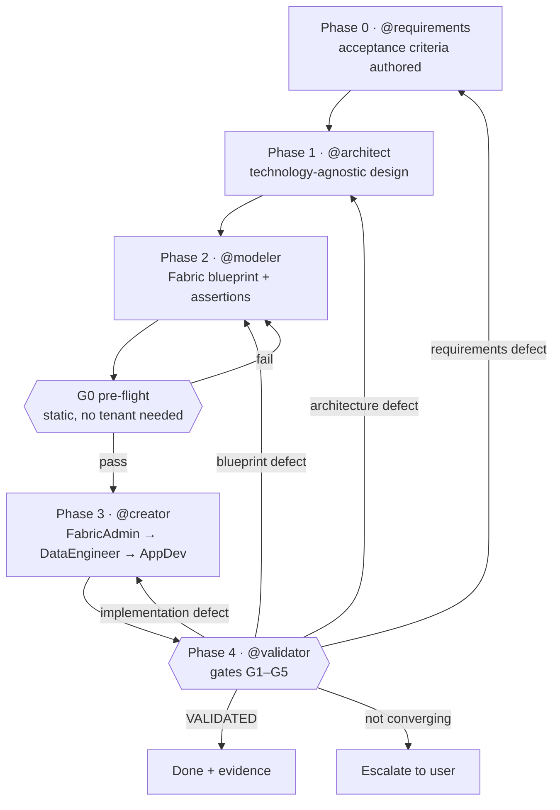

# AnalyticsPlatformAgents

> **Note:** This project is experimental. Agent-generated outputs should be reviewed before use in production environments. Always be the human in the loop.

A multi-agent system for designing and implementing analytics platforms on Microsoft Fabric.

## Agent Team

| Agent | File | Role |
|-------|------|------|
| **Orchestrator** | `agents/orchestrator.md` | Coordinates the end-to-end workflow across all agents |
| **Requirements** | `agents/requirements.md` | Elicits and documents business requirements in plain language before any technical design begins |
| **Architect** | `agents/architect.md` | Designs technology-agnostic analytics architectures (layers, SCD patterns, metadata framework) |
| **Modeler** | `agents/modeler.md` | Translates architecture specs into Fabric-specific blueprints (Lakehouse, Warehouse, Pipelines, Notebooks) |
| **Creator** | `agents/creator.agent.md` | Dispatcher for Phase 3 — reads blueprint, decomposes tasks, dispatches to Fabric agents in order |
| **FabricDataEngineer** | `agents/FabricDataEngineer.agent.md` | Cross-workload Fabric implementation — Spark, SQL, Pipelines, Medallion architecture |
| **FabricAdmin** | `agents/FabricAdmin.agent.md` | Workspace administration, governance, capacity, security |
| **FabricAppDev** | `agents/FabricAppDev.agent.md` | Full-stack applications consuming Fabric data (ODBC, XMLA, REST) |
| **FabricIQ** | `agents/FabricIQ.agent.md` | Answers data questions about Power BI reports and semantic models — discovers artifacts, generates and executes DAX |
| **FabricMigrationEngineer** | `agents/FabricMigrationEngineer.agent.md` | Orchestrates workload migration to Fabric from Synapse, HDInsight, or Databricks |
| **Validator** | `agents/validator.md` | Independently judges whether the platform satisfies its acceptance criteria; routes failures back to the phase that owns the cause |

## Workflow



1. **Requirements** — Requirements agent interviews stakeholders to understand business goals, use cases, data consumers, source systems, and non-functional needs. Produces `output/requirements.md` in plain language, including the **acceptance criteria** (`AC-nnn`) that define what "working" means.
2. **Technical Clarification** — Architect reads the requirements document and asks only what it cannot answer (schema style, SCD preferences, technology stack). Business elicitation is not repeated.
3. **Architecture** — Architect produces `output/architecture-spec.md` with layer definitions, entity catalogue, data flow diagrams, governance rules, and a requirements traceability matrix.
4. **Modelling** — Modeler consumes the architecture spec and produces `output/fabric-blueprint.md` with Fabric artifact mappings, DDL, notebook specs, pipeline definitions, and the validation specifications that bind each acceptance criterion to an executable assertion.
5. **Creation** — `@creator` reads the blueprint, decomposes tasks, and dispatches to Fabric agents in order: `@FabricAdmin` (workspaces, governance) → `@FabricDataEngineer` (artifacts, pipelines) → `@FabricAppDev` (consuming applications).
6. **Validation** — `@validator` judges the result against the acceptance criteria and produces `output/validation-report.md`. It writes no artifacts and fixes nothing, which is what makes its verdict worth anything.

Requirement IDs (`UC`, `NFR`, `AC`, `E`, `S`) are carried forward through every phase, so any downstream finding can be traced back to the business need that motivated it.

**This is a loop, not a waterfall.** Only `@validator` may send work backwards, and it routes each failure to the phase that owns the root cause rather than to whichever phase is nearest. The build is complete when validation says so — "deployed" and "working" are different claims, and only one of them matters to the business.

## Folder Structure

```
AnalyticsPlatformAgents/
├── agents/                    # Agent definitions (VS Code Copilot discovers these)
│   ├── orchestrator.md
│   ├── requirements.md        # Requirements Engineering Agent (Phase 0)
│   ├── architect.md
│   ├── modeler.md
│   ├── validator.md           # Validator Agent (Phase 4)
│   ├── FabricDataEngineer.agent.md
│   ├── FabricAdmin.agent.md
│   ├── FabricAppDev.agent.md
│   ├── FabricIQ.agent.md
│   ├── FabricMigrationEngineer.agent.md
│   └── creator.agent.md
├── .prompts/                  # Reusable prompt files
│   ├── 00-requirements.prompt.md
│   ├── 01-technical-clarification.prompt.md
│   ├── 02-architecture.prompt.md
│   ├── 03-receive-handoff.prompt.md
│   ├── 04-fabric-blueprint.prompt.md
│   └── 05-validation.prompt.md
├── .resources/                # Shared knowledge base
│   ├── kb-scd-fact-patterns.md
│   ├── kb-metadata-pipeline-framework.md
│   ├── kb-layered-architecture.md
│   ├── kb-fabric-artifacts.md
│   ├── kb-fabric-patterns.md
│   ├── kb-fabric-datatypes.md
│   └── kb-validation-assertions.md
├── creator/                       # Fabric Creator skills & knowledge (from skills-for-fabric)
│   ├── common/                    # 9 shared knowledge files (COMMON-CORE, SPARK-*, SQLDW-*, etc.)
│   ├── skills/                    # 13 specialised skills (spark-authoring, sqldw-authoring, powerbi, paginated-report, etc.)
│   ├── docs/                      # Skill authoring guides, architecture docs
│   ├── prompt_examples/           # Example prompts for Fabric workflows
│   └── mcp-setup/                 # MCP server configuration
├── output/                    # Runtime target for agent-generated deliverables
│   └── artifacts/             # Skeleton (notebooks, warehouse, pipelines)
├── output_examples/           # Committed example deliverables
│   ├── requirements.md        # Contoso Rail scenario example
│   ├── architecture-spec.md
│   ├── fabric-blueprint.md
│   └── artifacts/
└── .github/
    └── copilot-instructions.md
```

## Getting Started

1. Open this folder as a VS Code workspace.
2. Start with `@orchestrator` in Copilot Chat for a guided session, or invoke agents directly:
   - `@requirements` — Elicit and document business requirements (start here for new initiatives)
   - `@architect` — Run technical clarification and generate architecture spec
   - `@modeler` — Consume architecture spec and generate Fabric blueprint
   - `@creator` — Dispatch blueprint tasks to Fabric agents in order
   - `@validator` — Judge a blueprint (pre-flight) or a deployed platform against its acceptance criteria
   - `@FabricDataEngineer` — Implement cross-workload Fabric solutions
   - `@FabricAdmin` — Workspace governance and administration
   - `@FabricAppDev` — Build applications consuming Fabric data
3. The Fabric agents delegate to specialised skills in `creator/skills/` for endpoint-specific implementation.

## Validation

`@validator` is the team's independent judge. It never writes artifacts and never repairs anything — that separation is what makes its verdict meaningful, because an agent that builds and grades the same thing will always grade it favourably.

**Gates:**

| Gate | Question | Needs a tenant? |
|---|---|---|
| G0 | Is the blueprint buildable — type-legal, name-legal, capability-legal, acyclic? | No |
| G1 | Does every planned artifact exist? | Yes |
| G2 | Do deployed shapes match the DDL? | Yes |
| G3 | Does it actually run? | Yes |
| G4 | Are the numbers right? | Yes |
| G5 | Can a consumer use it, and is the wrong consumer denied? | Yes |

**Evidence providers** keep the loop usable without tenant access: `static` (repository files only, G0), `live` (a real deployment, G0–G5), and `recorded` (re-analysis of an earlier run). An assertion whose evidence is unavailable is reported `SKIPPED` — never `PASS`. A run where the `Must` criteria could not be checked is reported `NOT VALIDATED`, which is a distinct state from both success and failure.

Run G0 before every deployment. It costs nothing, needs no tenant, and catches the specification errors that are expensive to discover after the fact.

## Repository Hygiene

**Temporary Folder Policy:** All agents use temporary folders outside the repository for scratch work. Agents create timestamped folders in `$env:TEMP` (Windows) or `/tmp` (Linux/Mac) for analysis, intermediate outputs, and temporary artifacts. Only final, publishable deliverables are written to `output/`.

This prevents accidental commits of sensitive data (workspace IDs, subscription IDs, tenant-specific configurations) and keeps the repository clean for public sharing.

**Example Data Policy:** All examples use synthetic identifiers and fictional names only. Never commit real tenant, workspace, or customer identifiers, credentials, tokens, or local user paths.

`.github/workflows/tenant-data-scan.yml` enforces the GUID, credential, token, and local-path rules on every push and pull request. Identifying *names* cannot be detected automatically and remain a review responsibility.

## Creator Skills (from skills-for-fabric)

The `creator/` folder contains the official Microsoft Fabric skills from [aka.ms/skills-for-fabric](https://aka.ms/skills-for-fabric):

| Skill | Purpose |
|-------|---------|
| `spark-authoring-cli` | Notebook development, Lakehouse management, PySpark engineering |
| `spark-consumption-cli` | Interactive Spark analysis and exploration |
| `sqldw-authoring-cli` | T-SQL DDL/DML, Warehouse schema, ETL scripting |
| `sqldw-consumption-cli` | Read-only T-SQL analytics and exploration |
| `eventhouse-authoring-cli` | KQL management, Eventhouse operations, ingestion |
| `eventhouse-consumption-cli` | Read-only KQL queries against Eventhouse |
| `powerbi-authoring-cli` | Semantic model creation, TMDL, refresh, permissions |
| `powerbi-consumption-cli` | DAX queries and semantic model discovery |
| `e2e-medallion-architecture` | End-to-end Bronze/Silver/Gold lakehouse patterns |
| `check-updates` | Version check for skill updates |
| `paginated-report-ops` | Paginated report operations |
| `powerbi-ibcs` | IBCS-compliant PowerBI report patterns |

## Adding More Skills

Drop additional skill folders into `creator/skills/` following the same pattern (`SKILL.md` + optional `references/` or `resources/`). Shared knowledge goes in `creator/common/`.

## Outputs

At runtime, agents write their deliverables into `output/`, which is gitignored.
