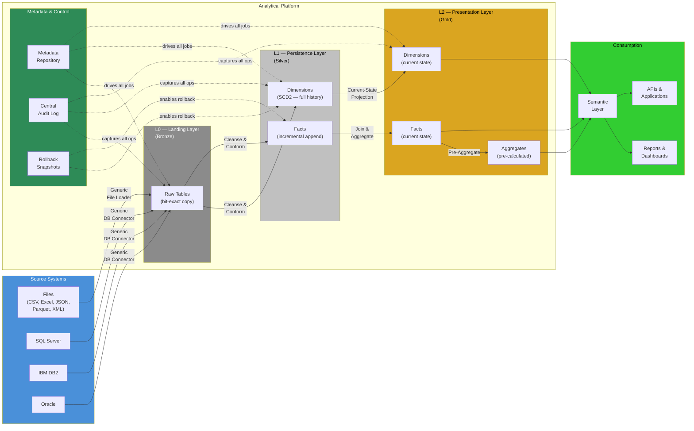
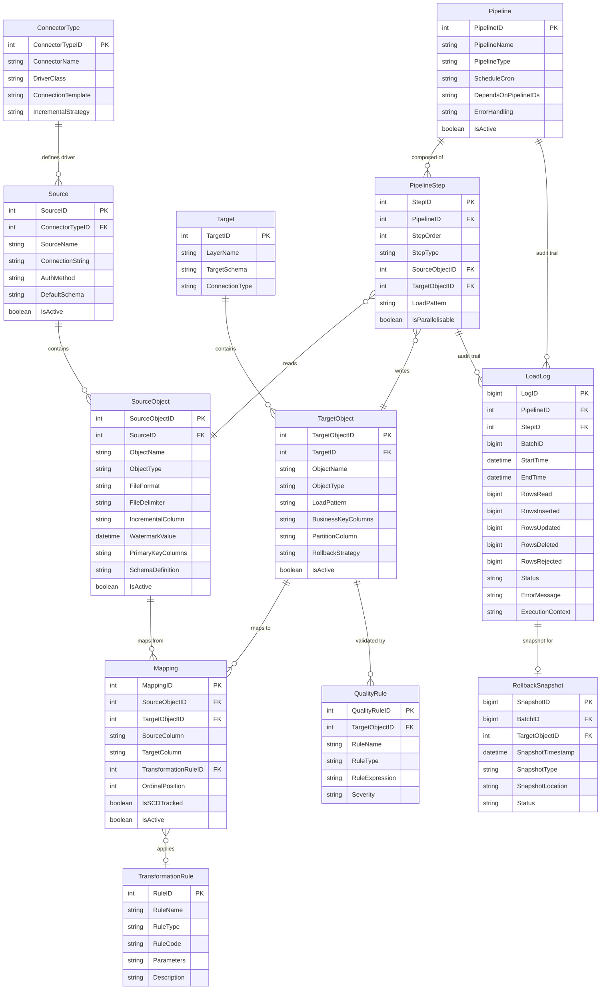
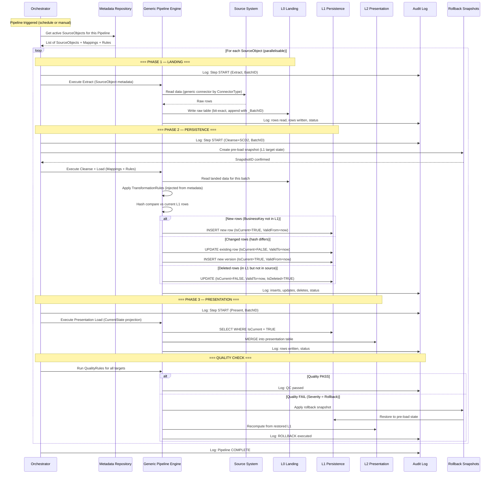
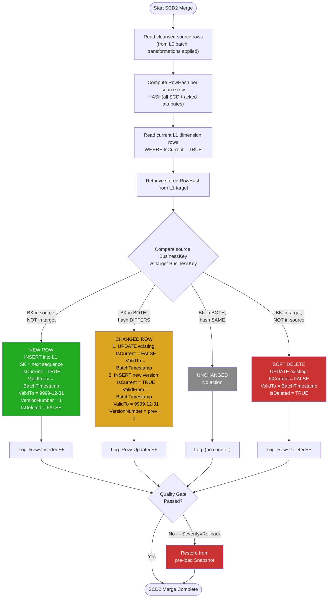
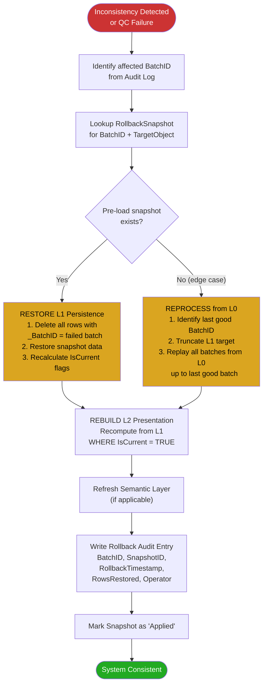

# Architecture Specification — Three-Layer Analytical Platform

> **Version:** 1.0  
> **Date:** 2026-03-13  
> **Status:** Proposed  
> **Author:** Analytics Architect Agent  

---

## Table of Contents

1. [Requirements Summary](#1-requirements-summary)
2. [Architecture Decision Records](#2-architecture-decision-records)
3. [Layer Architecture](#3-layer-architecture)
4. [Metadata Repository](#4-metadata-repository)
5. [Generic Pipeline Engine](#5-generic-pipeline-engine)
6. [SCD2 Historisation Pattern](#6-scd2-historisation-pattern)
7. [Presentation Layer — Current State Projection](#7-presentation-layer--current-state-projection)
8. [Central Audit Log](#8-central-audit-log)
9. [Rollback & Recovery](#9-rollback--recovery)
10. [Onboarding New Data Sources](#10-onboarding-new-data-sources)
11. [Modeler Agent Handoff Instructions](#11-modeler-agent-handoff-instructions)

---

## 1. Requirements Summary

| # | Requirement | Architectural Response |
|---|---|---|
| R1 | Three logical layers | L0 Landing, L1 Persistence, L2 Presentation |
| R2 | Accept files (CSV, Excel, JSON, Parquet, XML) | Generic File Connector in ConnectorType registry |
| R3 | Accept SQL Server, DB2, Oracle databases | Generic DB Connectors — one engine, driver per ConnectorType |
| R4 | Incremental loads into Silver | Watermark-based incremental extraction, delta detection by hash |
| R5 | Full history on dimensions (go back in time) | SCD Type 2 in L1 Persistence with ValidFrom/ValidTo/IsCurrent |
| R6 | Presentation layer shows current state (initially) | L2 = projection of L1 WHERE IsCurrent = TRUE (designed for later expansion to point-in-time) |
| R7 | Fully generic loading — no new jobs per source | Metadata-driven pipeline: new source = metadata rows, zero code |
| R8 | Single logging area, auditable | Central LoadLog table with BatchID, row counts, timestamps, status |
| R9 | Rollback to pre-load state on inconsistencies | Pre-load snapshots + BatchID-based restore + L2 rebuild |

---

## 2. Architecture Decision Records

### ADR-001: Three-Layer Architecture (L0/L1/L2)

**Status:** Proposed  
**Context:** The platform needs clear separation of raw ingestion, historised persistence, and business-ready presentation.  
**Decision:** Adopt a three-layer architecture: L0 (Landing/Bronze), L1 (Persistence/Silver with SCD2), L2 (Presentation/Gold with current state).  
**Consequences:**  
- (+) Clear data lifecycle and governance boundaries  
- (+) Full history preserved in L1 even when L2 shows only current state  
- (+) L2 can be expanded later to include point-in-time views without re-architecting  
- (−) Three layers means three sets of tables to manage (mitigated by metadata-driven approach)  

### ADR-002: SCD Type 2 for All Dimensions in L1

**Status:** Proposed  
**Context:** The business requirement is to "go back in time" on any dimension.  
**Decision:** Apply SCD Type 2 to all dimension tables in L1. Every change creates a new version row with ValidFrom/ValidTo/IsCurrent/VersionNumber.  
**Consequences:**  
- (+) Full history preserved — any point-in-time query is possible  
- (+) L2 current-state view is a trivial filter (IsCurrent = TRUE)  
- (−) L1 tables grow over time — mitigated by partitioning and archival policies  
- (−) SCD2 merge is more complex than simple overwrite — mitigated by generic engine  

### ADR-003: Metadata-Driven Generic Pipeline

**Status:** Proposed  
**Context:** The requirement is zero new code when new data arrives — only metadata entries.  
**Decision:** All pipeline behaviour is controlled by a metadata repository. The generic engine reads source/target/mapping/transformation/quality metadata and executes accordingly.  
**Consequences:**  
- (+) Adding a new source = INSERT metadata rows, no development  
- (+) Transformations are injectable — stored as code fragments in TransformationRule  
- (+) Single engine to maintain, test, and optimise  
- (−) Initial metadata repository setup is a one-time investment  
- (−) Complex transformations may need custom RuleType extensions  

### ADR-004: Pre-Load Snapshots for Rollback

**Status:** Proposed  
**Context:** Inconsistencies must be eliminable quickly with rollback to the state before a load.  
**Decision:** Before every L1 load step, create a snapshot of the affected target object's current state. On failure or detected inconsistency, restore the snapshot, then rebuild L2 from L1.  
**Consequences:**  
- (+) Rapid recovery — no need to replay all history  
- (+) Audit trail records every rollback  
- (−) Snapshot storage cost — mitigated by retention policy (keep last N snapshots)  
- (−) Snapshot creation adds time to each load — mitigated by only snapshotting changed partitions  

### ADR-005: Current-State-Only Presentation Layer (Upgradeable)

**Status:** Proposed  
**Context:** L2 initially shows only the current state, but the requirement may change.  
**Decision:** L2 is a materialised projection of L1 using `WHERE IsCurrent = TRUE`. The L2 schema includes surrogate keys that reference L1, so it can later be extended to point-in-time views by adding ValidFrom/ValidTo to L2 or by exposing L1 directly.  
**Consequences:**  
- (+) Simple and performant for initial reporting  
- (+) Upgrade path is clear: change LoadPattern from CurrentState to SCD2 in metadata  
- (−) Initial L2 does not support as-of queries (acceptable per requirements)  

---

## 3. Layer Architecture

### Platform Context Diagram



### Layer Inventory

| Layer | Name | Alias | Purpose | Persistence | Format | Governance |
|---|---|---|---|---|---|---|
| **L0** | Landing | Bronze / Raw | Bit-exact copy of source data, no transformations | Immutable append (partitioned by BatchID) | Raw tables / files | Low — accept everything |
| **L1** | Persistence | Silver / History | Cleansed, conformed, fully historised (SCD2 for dims, incremental for facts) | SCD2 versioned rows (dims), incremental append (facts) | Typed relational tables | High — quality gates enforced |
| **L2** | Presentation | Gold / Serve | Current-state view, business-ready, optimised for consumption | Materialised from L1 (IsCurrent = TRUE) | Star-Join schema | High — consumption-ready |

### Layer Contracts

#### L0 Entry Contract
- Data arrives from a **registered** source (exists in Source + SourceObject metadata)
- Connector type has a valid driver in ConnectorType registry
- File format matches SourceObject.FileFormat declaration

#### L0 Exit Contract
- All rows written with system metadata: `_BatchID`, `_LoadTimestamp`, `_SourceSystem`, `_SourceObject`
- Row count logged to LoadLog
- No transformations applied — data is bit-exact

#### L1 Entry Contract (Quality Gate: L0 → L1)
- L0 batch is complete (LoadLog status = Success)
- Schema validation: columns match SourceObject.SchemaDefinition
- No NULLs in declared PrimaryKeyColumns

#### L1 Exit Contract
- All dimensions: SCD2 rules applied (ValidFrom/ValidTo/IsCurrent consistent)
- All facts: incremental rows appended with FK references resolved
- RowHash computed and stored for change detection
- Quality rules passed (NotNull, Unique on BK+IsCurrent, FK integrity)

#### L2 Entry Contract (Quality Gate: L1 → L2)
- L1 load completed successfully
- IsCurrent flags are consistent (exactly one current row per BusinessKey)

#### L2 Exit Contract
- Presentation tables match expected row counts (one row per BusinessKey for dims)
- All FK relationships valid
- Semantic layer refresh triggered (if applicable)

### L0 Table Structure (Generic — per SourceObject)

Every L0 table follows this pattern:

| Column | Data Type | Source |
|---|---|---|
| `_BatchID` | BIGINT | System-generated per pipeline run |
| `_LoadTimestamp` | DATETIME | System timestamp at extraction |
| `_SourceSystem` | VARCHAR | From Source.SourceName |
| `_SourceObject` | VARCHAR | From SourceObject.ObjectName |
| `_FileName` | VARCHAR | File path (file sources only, NULL for DB) |
| *(all source columns)* | *(source-native types)* | Bit-exact copy |

### L1 Dimension Structure (Generic — SCD2)

| Column | Data Type | Purpose |
|---|---|---|
| `SK_<EntityName>` | BIGINT (surrogate) | Surrogate key — unique per version row |
| `BK_<EntityName>` | *(matches source)* | Business key — stable across versions |
| *(mapped attributes)* | *(conformed types)* | Business attributes from Mapping metadata |
| `_RowHash` | BINARY/VARCHAR | Hash of all SCD-tracked attributes |
| `_ValidFrom` | DATETIME | Version start timestamp |
| `_ValidTo` | DATETIME | Version end timestamp (9999-12-31 = current) |
| `_IsCurrent` | BOOLEAN | TRUE for the active version |
| `_VersionNumber` | INT | Incrementing version counter |
| `_IsDeleted` | BOOLEAN | Soft-delete flag |
| `_BatchID` | BIGINT | Which load batch created this row |
| `_LoadTimestamp` | DATETIME | When this row was written |

### L1 Fact Structure (Generic — Incremental)

| Column | Data Type | Purpose |
|---|---|---|
| `SK_<FactName>` | BIGINT (surrogate) | Fact row identifier |
| `FK_<Dim1>` | BIGINT | Surrogate FK to L1 dimension (current version) |
| `FK_<Dim2>` | BIGINT | (repeat for all dimensions) |
| `DD_<DegenerateDim>` | *(varies)* | Degenerate dimension (e.g., InvoiceNumber) |
| `M_<Measure1>` | NUMERIC | Additive measure |
| `M_<Measure2>` | NUMERIC | Semi-additive or non-additive measure |
| `_BatchID` | BIGINT | Which load batch created this row |
| `_LoadTimestamp` | DATETIME | When this row was written |

### L2 Presentation Structure (Current State)

| Column | Data Type | Purpose |
|---|---|---|
| `SK_<EntityName>` | BIGINT | Mirrors L1 surrogate key of current version |
| `BK_<EntityName>` | *(matches L1)* | Business key |
| *(mapped attributes)* | *(matches L1)* | Current-state values only |
| `_LastRefreshTimestamp` | DATETIME | When L2 was last rebuilt |

> **Future expansion:** To support point-in-time in L2, change LoadPattern from `CurrentState` to `SCD2` in the metadata. The generic engine will automatically produce versioned L2 rows.

---

## 4. Metadata Repository

### Metadata Repository ER Diagram



### Entity Summary

| Entity | Row Count Estimate | Purpose |
|---|---|---|
| `ConnectorType` | 4 (SQLServer, DB2, Oracle, File) | Driver/connection templates |
| `Source` | ~5–20 | Registered source systems |
| `SourceObject` | ~50–500 | Tables/files per source |
| `Target` | 3 (one per layer) | L0, L1, L2 targets |
| `TargetObject` | ~150–1500 (3× SourceObject) | Landing, persistence, presentation per source object |
| `Mapping` | ~1000–10000 | Column-level source→target maps |
| `TransformationRule` | ~50–200 | Reusable transformation library |
| `Pipeline` | ~5–20 | Orchestrated job definitions |
| `PipelineStep` | ~100–1000 | Individual steps per pipeline |
| `QualityRule` | ~200–2000 | Validation rules per target object |
| `LoadLog` | Unbounded (append) | Execution audit trail |
| `RollbackSnapshot` | ~last N batches per target | Pre-load state snapshots |

### ConnectorType Seed Data

| ConnectorTypeID | ConnectorName | IncrementalStrategy |
|---|---|---|
| 1 | SQL Server | Watermark (datetime/rowversion) or CDC |
| 2 | IBM DB2 | Watermark (timestamp column) |
| 3 | Oracle | Watermark (SCN or datetime) or LogMiner CDC |
| 4 | File | Full reload per file drop (new files = incremental) |

### Transformation Rule Library (Initial Set)

| RuleID | RuleName | RuleType | RuleCode | Description |
|---|---|---|---|---|
| 1 | DirectCopy | DirectCopy | *(none)* | 1:1 column mapping, no transformation |
| 2 | TrimUpperCase | SQL | `UPPER(TRIM({source_column}))` | Standardise text to upper-trimmed |
| 3 | NullToDefault | SQL | `COALESCE({source_column}, {param1})` | Replace NULL with default value |
| 4 | DateParse | SQL | `CAST({source_column} AS DATE)` | Parse string to date |
| 5 | CompositeKey | Expression | `CONCAT({col_a}, '|', {col_b})` | Build composite business key |
| 6 | LookupDimSK | Lookup | `{dim_table}:{bk_column}:{sk_column}` | Resolve dimension surrogate key |
| 7 | HashRow | HashKey | `HASH({col_a}, {col_b}, ..., {col_n})` | Compute hash for SCD detection |
| 8 | ConditionalMap | Conditional | `CASE WHEN {status}='A' THEN 'Active' ELSE 'Inactive' END` | Code-to-description mapping |
| 9 | SurrogateKey | SurrogateKey | `NEXT_SEQUENCE('{target_table}_seq')` | Generate surrogate key |
| 10 | NumericConvert | SQL | `CAST({source_column} AS DECIMAL({param1},{param2}))` | String to decimal conversion |

---

## 5. Generic Pipeline Engine

### Generic Pipeline Execution Sequence



### Pipeline Archetypes

The engine supports these pipeline patterns, driven entirely by metadata:

| Archetype | LoadPattern Value | Used In Layer | Steps |
|---|---|---|---|
| **Full Reload** | `FullReload` | L0 (all), L1 (small ref tables) | Extract → Truncate/Append → QC |
| **Incremental** | `Incremental` | L1 (facts) | Read Watermark → Extract Delta → Append → Update Watermark → QC |
| **SCD2** | `SCD2` | L1 (dimensions) | Extract → Hash Compare → Insert/Expire/SoftDelete → QC |
| **Current State** | `CurrentState` | L2 (all) | Read L1 IsCurrent → Rebuild L2 table → QC |
| **Aggregate** | `Aggregate` | L2 (aggregate tables) | Read L1/L2 → Compute aggregates → Swap → QC |

### Execution Pseudocode

```
FUNCTION execute_pipeline(PipelineID):
    batch_id = generate_batch_id()
    pipeline = metadata.get_pipeline(PipelineID)
    steps = metadata.get_steps(PipelineID, ordered_by=StepOrder)
    
    log(PipelineID, batch_id, "Pipeline START")
    
    FOR EACH step IN steps:
        source_obj = metadata.get_source_object(step.SourceObjectID)
        target_obj = metadata.get_target_object(step.TargetObjectID)
        mappings = metadata.get_mappings(source_obj.ID, target_obj.ID)
        quality_rules = metadata.get_quality_rules(target_obj.ID)
        
        log(step.StepID, batch_id, "Step START")
        
        -- PRE-LOAD SNAPSHOT (for L1 and L2 targets)
        IF target_obj.RollbackStrategy = 'Snapshot':
            create_snapshot(batch_id, target_obj)
        
        -- BUILD EXTRACT QUERY
        IF step.StepType = 'Extract':
            connector = get_connector(source_obj.Source.ConnectorType)
            IF source_obj.IncrementalColumn IS NOT NULL:
                query = connector.build_incremental_query(
                    source_obj, watermark=source_obj.WatermarkValue)
            ELSE:
                query = connector.build_full_query(source_obj)
            raw_data = connector.execute(query)
        
        -- BUILD TRANSFORM + LOAD
        IF step.StepType IN ('Transform', 'Load'):
            FOR EACH mapping IN mappings:
                IF mapping.TransformationRuleID IS NOT NULL:
                    rule = metadata.get_rule(mapping.TransformationRuleID)
                    -- INJECT rule code into the column expression
                    column_expr = rule.inject(mapping.SourceColumn, rule.Parameters)
                ELSE:
                    column_expr = mapping.SourceColumn  -- direct copy
            
            -- EXECUTE LOAD PATTERN
            SWITCH target_obj.LoadPattern:
                CASE 'FullReload':
                    truncate(target_obj)
                    insert(target_obj, transformed_data, batch_id)
                
                CASE 'Incremental':
                    insert(target_obj, transformed_data, batch_id)
                    update_watermark(source_obj, max_incremental_value)
                
                CASE 'SCD2':
                    execute_scd2_merge(target_obj, transformed_data, batch_id)
                
                CASE 'CurrentState':
                    merge_current_state(target_obj, 
                        source=L1_table WHERE IsCurrent=TRUE, batch_id)
                
                CASE 'Aggregate':
                    compute_and_swap(target_obj, batch_id)
        
        -- QUALITY CHECK
        FOR EACH qr IN quality_rules:
            result = evaluate_quality_rule(qr, target_obj)
            IF result = FAIL AND qr.Severity = 'Rollback':
                apply_rollback(batch_id, target_obj)
                log(step.StepID, batch_id, "ROLLBACK", qr.RuleName)
                RAISE PipelineRollbackException
            ELIF result = FAIL AND qr.Severity = 'Warn':
                log(step.StepID, batch_id, "WARNING", qr.RuleName)
        
        log(step.StepID, batch_id, "Step COMPLETE", row_counts)
    
    log(PipelineID, batch_id, "Pipeline COMPLETE")
```

### How Transformations Are Injected

The key to the metadata-driven approach is that **transformation code is stored, not hardcoded**:

```
Example: Loading a Customer dimension from Oracle

Metadata in TransformationRule:
  RuleID=8, RuleName='StatusMapping', RuleType='Conditional'
  RuleCode='CASE WHEN {source_column}=''A'' THEN ''Active'' 
                 WHEN {source_column}=''I'' THEN ''Inactive'' 
                 ELSE ''Unknown'' END'

Metadata in Mapping:
  SourceColumn='CUST_STATUS', TargetColumn='CustomerStatus', 
  TransformationRuleID=8

At runtime, the engine generates:
  SELECT 
      CUST_ID AS BK_Customer,
      UPPER(TRIM(CUST_NAME)) AS CustomerName,              -- Rule 2
      CASE WHEN CUST_STATUS='A' THEN 'Active'              -- Rule 8
           WHEN CUST_STATUS='I' THEN 'Inactive' 
           ELSE 'Unknown' END AS CustomerStatus,
      COALESCE(CUST_EMAIL, 'N/A') AS CustomerEmail,        -- Rule 3
      HASH(CUST_NAME, CUST_STATUS, CUST_EMAIL) AS _RowHash -- Rule 7
  FROM source.CUSTOMERS
  WHERE LAST_MODIFIED > @watermark
```

No code was written for this customer table. It was entirely assembled from metadata.

---

## 6. SCD2 Historisation Pattern

### Dimension Column Template

For every dimension in L1, the following columns are present:

| Column Category | Columns | Managed By |
|---|---|---|
| **Surrogate Key** | `SK_<Entity>` (BIGINT, auto-increment) | Generic engine (SurrogateKey rule) |
| **Business Key** | `BK_<Entity>` (from source PK) | Mapping metadata |
| **Attributes** | *(from Mapping)* | Mapping + TransformationRule metadata |
| **Change Detection** | `_RowHash` | HashRow rule (all IsSCDTracked columns) |
| **Versioning** | `_ValidFrom`, `_ValidTo`, `_IsCurrent`, `_VersionNumber` | SCD2 engine logic |
| **Soft Delete** | `_IsDeleted` | SCD2 engine (source row absent) |
| **Audit** | `_BatchID`, `_LoadTimestamp` | Pipeline engine |

### SCD2 Merge Decision Flowchart



### SCD2 Merge Logic (Decision Table)

| Source Row | Target Row (IsCurrent=TRUE) | Action |
|---|---|---|
| Exists | Does not exist | **INSERT** new row: IsCurrent=TRUE, ValidFrom=now, ValidTo=9999-12-31, V=1 |
| Exists | Exists, hash same | **NO ACTION** |
| Exists | Exists, hash differs | **EXPIRE** target: IsCurrent=FALSE, ValidTo=now. **INSERT** new version: IsCurrent=TRUE, ValidFrom=now, V=prev+1 |
| Does not exist | Exists | **SOFT DELETE**: IsCurrent=FALSE, ValidTo=now, IsDeleted=TRUE |

### Late-Arriving Dimension Handling

If a fact row references a dimension BusinessKey that doesn't yet exist in L1:

1. Insert a **placeholder row** in L1 dimension: BK populated, all attributes = 'Unknown' / defaults, `_IsCurrent=TRUE`
2. When the actual dimension data arrives in a subsequent batch, normal SCD2 merge detects the change (hash differs) → expires the placeholder, inserts the real version
3. L2 automatically picks up the corrected version on next refresh

---

## 7. Presentation Layer — Current State Projection

### Load Pattern: CurrentState

L2 tables are materialised projections of L1:

```
-- Generic L2 rebuild for a dimension
MERGE INTO L2_Presentation.<Entity> AS tgt
USING (
    SELECT SK_<Entity>, BK_<Entity>, <all_mapped_attributes>
    FROM L1_Persistence.<Entity>
    WHERE _IsCurrent = TRUE AND _IsDeleted = FALSE
) AS src
ON tgt.BK_<Entity> = src.BK_<Entity>
WHEN MATCHED THEN UPDATE SET
    tgt.SK_<Entity> = src.SK_<Entity>,
    tgt.<attr1> = src.<attr1>,
    ...
    tgt._LastRefreshTimestamp = @BatchTimestamp
WHEN NOT MATCHED BY TARGET THEN INSERT (...)
    VALUES (src.SK_<Entity>, src.BK_<Entity>, src.<attr1>, ..., @BatchTimestamp)
WHEN NOT MATCHED BY SOURCE THEN DELETE;
```

### Future Upgrade Path

When the business needs point-in-time queries in L2:

1. Change `TargetObject.LoadPattern` from `CurrentState` to `SCD2` in metadata
2. Add `_ValidFrom`, `_ValidTo`, `_IsCurrent` columns to L2 table (schema migration)
3. The generic engine automatically switches to SCD2 merge logic for L2
4. **No pipeline code changes required** — only metadata + schema DDL

---

## 8. Central Audit Log

### LoadLog Table Design

All pipeline operations write to a single `LoadLog` table:

| Column | Type | Description |
|---|---|---|
| `LogID` | BIGINT (auto) | Unique log entry |
| `BatchID` | BIGINT | Groups all operations in one pipeline run |
| `PipelineID` | INT FK | Which pipeline |
| `StepID` | INT FK | Which step (NULL for pipeline-level entries) |
| `SourceObjectID` | INT FK | Source being processed |
| `TargetObjectID` | INT FK | Target being written |
| `OperationType` | VARCHAR | Extract, Cleanse, Transform, Load, QualityCheck, Snapshot, Rollback |
| `StartTime` | DATETIME | Operation start |
| `EndTime` | DATETIME | Operation end |
| `Duration_Seconds` | COMPUTED | EndTime - StartTime |
| `RowsRead` | BIGINT | Rows extracted from source |
| `RowsInserted` | BIGINT | New rows inserted |
| `RowsUpdated` | BIGINT | Existing rows updated (expired + new version in SCD2) |
| `RowsDeleted` | BIGINT | Rows soft-deleted |
| `RowsRejected` | BIGINT | Rows that failed quality checks |
| `Status` | VARCHAR | Running, Success, Warning, Failed, RolledBack |
| `ErrorMessage` | TEXT | Error details (NULL on success) |
| `QualityRuleName` | VARCHAR | Which QC rule triggered (for QC entries) |
| `SnapshotID` | BIGINT FK | Reference to snapshot (for snapshot/rollback entries) |
| `ExecutionContext` | TEXT | Runtime parameters, watermark values, metadata version |
| `Operator` | VARCHAR | System account or manual operator (for audit) |

### Auditability Features

1. **BatchID correlation:** Every row written to L0/L1/L2 carries a `_BatchID`, traceable back to LoadLog
2. **Immutable log:** LoadLog is append-only, never updated or deleted
3. **Full operational lineage:** For any row in any layer, you can trace: which batch loaded it, which pipeline step, which source, what transformations were applied, what quality checks passed
4. **Rollback audit:** Rollback operations are themselves logged with the original BatchID and SnapshotID

### Example Audit Query

```
-- Show full audit trail for a specific batch
SELECT 
    l.OperationType, l.Status,
    l.StartTime, l.EndTime, l.Duration_Seconds,
    l.RowsRead, l.RowsInserted, l.RowsUpdated, l.RowsDeleted, l.RowsRejected,
    p.PipelineName, 
    so.ObjectName AS SourceObject,
    to2.ObjectName AS TargetObject,
    l.ErrorMessage
FROM LoadLog l
JOIN Pipeline p ON l.PipelineID = p.PipelineID
LEFT JOIN SourceObject so ON l.SourceObjectID = so.SourceObjectID
LEFT JOIN TargetObject to2 ON l.TargetObjectID = to2.TargetObjectID
WHERE l.BatchID = @BatchID
ORDER BY l.StartTime;
```

---

## 9. Rollback & Recovery

### Strategy Overview

| Scenario | Detection | Recovery Method | Recovery Time |
|---|---|---|---|
| **QC failure during load** | Automatic (QualityRule severity=Rollback) | Restore pre-load snapshot → rebuild L2 | Seconds to minutes |
| **Data issue discovered post-load** | Manual investigation | Identify BatchID → restore snapshot → rebuild L2 | Minutes |
| **Multiple bad batches** | Manual investigation | Identify last good BatchID → reprocess from L0 | Longer (depends on volume) |

### Rollback Strategy Flowchart



### Pre-Load Snapshot Mechanism

Before each L1 load step:

1. **Capture** the current state of the target object (or affected partition)
2. **Store** as a snapshot (technology-specific: table copy, file export, or platform time-travel bookmark)
3. **Register** in `RollbackSnapshot` with BatchID, TargetObjectID, SnapshotLocation, Status=Active

### Rollback Procedure

```
FUNCTION apply_rollback(batch_id, target_object_id):
    -- 1. Find the snapshot
    snapshot = SELECT * FROM RollbackSnapshot 
               WHERE BatchID = batch_id 
               AND TargetObjectID = target_object_id 
               AND Status = 'Active'
    
    -- 2. Restore L1 target to snapshot state
    restore_from_snapshot(target_object_id, snapshot.SnapshotLocation)
    
    -- 3. Rebuild L2 for this entity
    rebuild_l2_current_state(target_object_id)
    
    -- 4. Audit
    INSERT INTO LoadLog (BatchID, TargetObjectID, OperationType, Status, SnapshotID, ...)
    VALUES (batch_id, target_object_id, 'Rollback', 'RolledBack', snapshot.SnapshotID, ...)
    
    -- 5. Mark snapshot as applied
    UPDATE RollbackSnapshot SET Status = 'Applied' WHERE SnapshotID = snapshot.SnapshotID
    
    -- 6. Mark original load log entries as rolled back
    UPDATE LoadLog SET Status = 'RolledBack' WHERE BatchID = batch_id AND TargetObjectID = target_object_id
```

### Snapshot Retention Policy

| Rule | Value |
|---|---|
| Keep last N successful snapshots per target | N = 3 (configurable) |
| Keep all snapshots for last N days | N = 7 (configurable) |
| Expire old snapshots | Status → 'Expired', storage reclaimed |
| Never expire snapshots referenced by a RolledBack LoadLog entry | Permanent audit trail |

### Why L0 Is Immutable (Safety Net)

L0 Landing data is **never overwritten or deleted** (within retention window). This means:

- Even if L1 snapshots are lost, you can **replay from L0** to rebuild L1
- Replay is slower but provides an ultimate safety net
- L0 retention should be at least as long as the maximum acceptable replay window

---

## 10. Onboarding New Data Sources

### New Source Onboarding Workflow

```mermaid
flowchart LR
    subgraph Step1["1. Register Source"]
        A1["INSERT into Source\n(if new system)"]
        A2["INSERT into SourceObject\n- ObjectName\n- ObjectType\n- IncrementalColumn\n- PrimaryKeyColumns"]
    end

    subgraph Step2["2. Define Targets"]
        B1["INSERT TargetObject for L0\nLoadPattern = FullReload"]
        B2["INSERT TargetObject for L1\nLoadPattern = SCD2 or Incremental"]
        B3["INSERT TargetObject for L2\nLoadPattern = CurrentState"]
    end

    subgraph Step3["3. Map Columns"]
        C1["INSERT Mapping rows\n- SourceColumn to TargetColumn\n- TransformationRuleID\n- IsSCDTracked flag"]
    end

    subgraph Step4["4. Add Quality Rules"]
        D1["INSERT QualityRules\nfor each TargetObject"]
    end

    subgraph Step5["5. Pipeline Steps"]
        E1["INSERT PipelineSteps\ninto existing Pipeline"]
    end

    subgraph Step6["6. Done — Zero Code"]
        F1["Next pipeline run\nautomatically picks up\nnew SourceObject"]
    end

    Step1 --> Step2 --> Step3 --> Step4 --> Step5 --> Step6

    style Step1 fill:#4A90D9,color:#fff
    style Step2 fill:#4A90D9,color:#fff
    style Step3 fill:#4A90D9,color:#fff
    style Step4 fill:#4A90D9,color:#fff
    style Step5 fill:#4A90D9,color:#fff
    style Step6 fill:#22AA22,color:#fff
```



### Step-by-Step (Zero Code)

To add a new source table (e.g., `PRODUCTS` from Oracle):

**Step 1 — Register Source** (skip if Oracle source already registered)
```
INSERT INTO Source (SourceName, ConnectorTypeID, ConnectionString, AuthMethod)
VALUES ('Oracle_ERP', 3, '<connection_string>', 'ServiceAccount');
```

**Step 2 — Register SourceObject**
```
INSERT INTO SourceObject (SourceID, ObjectName, ObjectType, IncrementalColumn, PrimaryKeyColumns)
VALUES (@OracleSourceID, 'PRODUCTS', 'Table', 'LAST_MODIFIED', 'PRODUCT_ID');
```

**Step 3 — Register TargetObjects** (one per layer)
```
-- L0
INSERT INTO TargetObject (TargetID, ObjectName, ObjectType, LoadPattern)
VALUES (@L0_TargetID, 'raw_products', 'Raw', 'FullReload');

-- L1
INSERT INTO TargetObject (TargetID, ObjectName, ObjectType, LoadPattern, BusinessKeyColumns, RollbackStrategy)
VALUES (@L1_TargetID, 'dim_product', 'Dimension', 'SCD2', 'BK_Product', 'Snapshot');

-- L2
INSERT INTO TargetObject (TargetID, ObjectName, ObjectType, LoadPattern, BusinessKeyColumns)
VALUES (@L2_TargetID, 'dim_product', 'Dimension', 'CurrentState', 'BK_Product');
```

**Step 4 — Define Mappings**
```
INSERT INTO Mapping (SourceObjectID, TargetObjectID, SourceColumn, TargetColumn, TransformationRuleID, IsSCDTracked)
VALUES 
    (@SrcObjID, @L1_TgtObjID, 'PRODUCT_ID',   'BK_Product',    1, FALSE),  -- DirectCopy
    (@SrcObjID, @L1_TgtObjID, 'PRODUCT_NAME',  'ProductName',   2, TRUE),   -- TrimUpperCase + SCD tracked
    (@SrcObjID, @L1_TgtObjID, 'CATEGORY',      'Category',      2, TRUE),   -- TrimUpperCase + SCD tracked
    (@SrcObjID, @L1_TgtObjID, 'UNIT_PRICE',    'UnitPrice',     10, TRUE),  -- NumericConvert + SCD tracked
    (@SrcObjID, @L1_TgtObjID, 'STATUS',        'ProductStatus', 8, TRUE);   -- ConditionalMap + SCD tracked
```

**Step 5 — Add Quality Rules**
```
INSERT INTO QualityRule (TargetObjectID, RuleName, RuleType, RuleExpression, Severity)
VALUES
    (@L1_TgtObjID, 'BK_NotNull',    'NotNull',  'BK_Product IS NOT NULL', 'Fail'),
    (@L1_TgtObjID, 'BK_Unique',     'Unique',   'BK_Product (WHERE _IsCurrent=TRUE)', 'Rollback'),
    (@L1_TgtObjID, 'Price_Positive', 'Range',   'UnitPrice >= 0', 'Warn');
```

**Step 6 — Add Pipeline Steps**
```
INSERT INTO PipelineStep (PipelineID, StepOrder, StepType, SourceObjectID, TargetObjectID, LoadPattern)
VALUES
    (@MainPipelineID, NEXT_ORDER(), 'Extract',   @SrcObjID,    @L0_TgtObjID, 'FullReload'),
    (@MainPipelineID, NEXT_ORDER(), 'Transform', @L0_TgtObjID, @L1_TgtObjID, 'SCD2'),
    (@MainPipelineID, NEXT_ORDER(), 'Load',      @L1_TgtObjID, @L2_TgtObjID, 'CurrentState');
```

**Done.** Next pipeline run picks up `PRODUCTS` automatically. No code written.

---

## 11. Modeler Agent Handoff Instructions

This section tells the Modeler Agent exactly what to implement.

### What to Implement

| Component | Description |
|---|---|
| **Metadata Repository** | 12 tables as specified in §4, with seed data for ConnectorTypes and TransformationRules |
| **L0 Landing tables** | Auto-generated DDL per SourceObject (schema from metadata + system columns) |
| **L1 Persistence tables** | Dimension tables with SCD2 columns, fact tables with FK + measures |
| **L2 Presentation tables** | Current-state mirrors of L1 (no versioning columns) |
| **Generic Pipeline Engine** | One engine that reads metadata and executes Extract → Transform → Load patterns |
| **Audit Log** | Single LoadLog table with all specified columns |
| **Rollback Snapshots** | Snapshot mechanism appropriate to the target technology |
| **Quality Rules Engine** | Rule evaluator that reads QualityRule metadata and applies checks |

### Technology-Agnostic — Modeler Decides

The Modeler Agent should map these logical concepts to the chosen technology:

| Logical Concept | Technology Decision Needed |
|---|---|
| Metadata repository tables | SQL database, config files, or platform metadata store |
| Generic connectors | JDBC/ODBC drivers, native connectors, or platform connectors |
| SCD2 merge | MERGE statement, Delta Lake merge, platform-specific SCD operator |
| Snapshots | Table cloning, file copy, Delta time travel, database snapshots |
| Hash computation | SHA-256, MD5, or platform-native hash function |
| Surrogate keys | Auto-increment, sequences, or hash-based |
| Orchestration | Scheduler/DAG engine (Airflow, ADF, Fabric Pipelines, etc.) |
| Quality checks | SQL assertions, framework rules, or external DQ tool |

### Naming Conventions (Suggested)

| Layer | Schema Prefix | Table Prefix | Example |
|---|---|---|---|
| L0 | `raw` or `landing` | `raw_` | `raw.raw_customers` |
| L1 | `persist` or `silver` | `dim_`, `fact_` | `persist.dim_customer`, `persist.fact_sales` |
| L2 | `present` or `gold` | `dim_`, `fact_`, `agg_` | `present.dim_customer`, `present.agg_sales_monthly` |
| Metadata | `meta` | *(as specified)* | `meta.Source`, `meta.Pipeline` |
| Audit | `audit` | *(as specified)* | `audit.LoadLog`, `audit.RollbackSnapshot` |

### Physical Optimization Hints

- **L0:** Partition by `_BatchID` or `_LoadTimestamp` for efficient batch-level access
- **L1 Dimensions:** Index on `BK_<Entity>` + `_IsCurrent` for fast SCD2 lookup
- **L1 Facts:** Partition by date dimension FK for range scans
- **L2:** Optimise for read performance (BI tool access patterns)
- **LoadLog:** Partition by date, index on `BatchID` and `PipelineID`
- **RollbackSnapshot:** Index on `BatchID` + `TargetObjectID`

### Security Requirements

- Metadata repository: read/write for pipeline service account, read-only for analysts
- L0: write by pipeline only, read by pipeline + data engineers
- L1: write by pipeline only, read by pipeline + advanced analysts
- L2: write by pipeline only, read by all consumers (reports, semantic layer, APIs)
- LoadLog: write by pipeline only, read by operations + auditors
- Connection strings / credentials: stored in secrets management (KeyVault or equivalent), never in metadata tables
