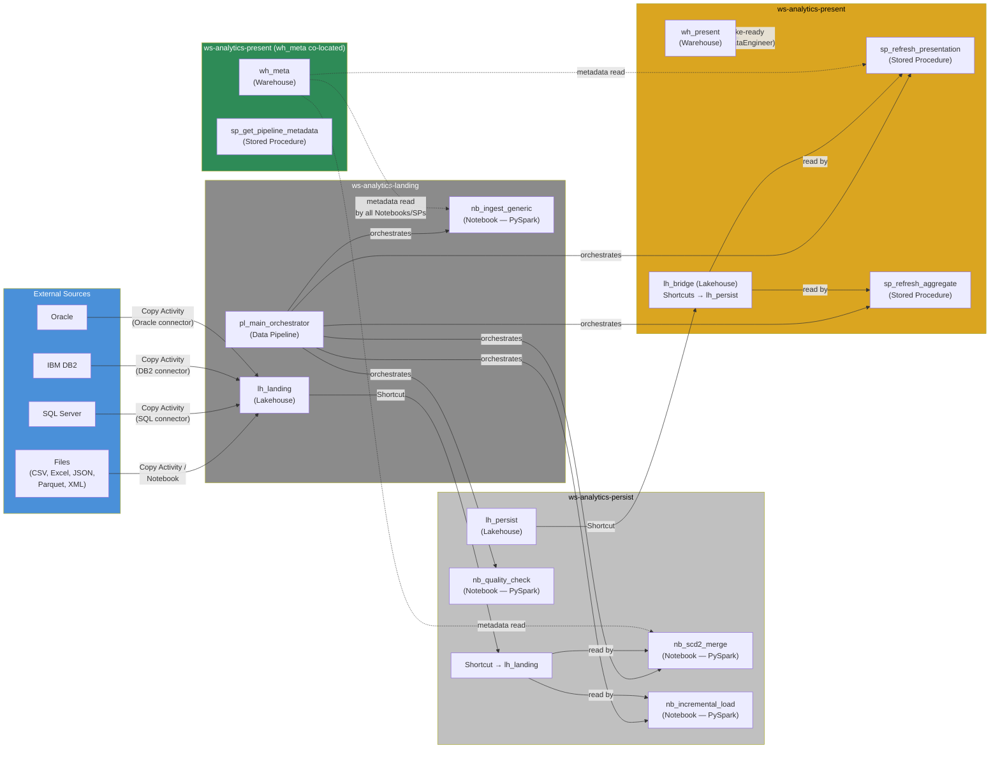
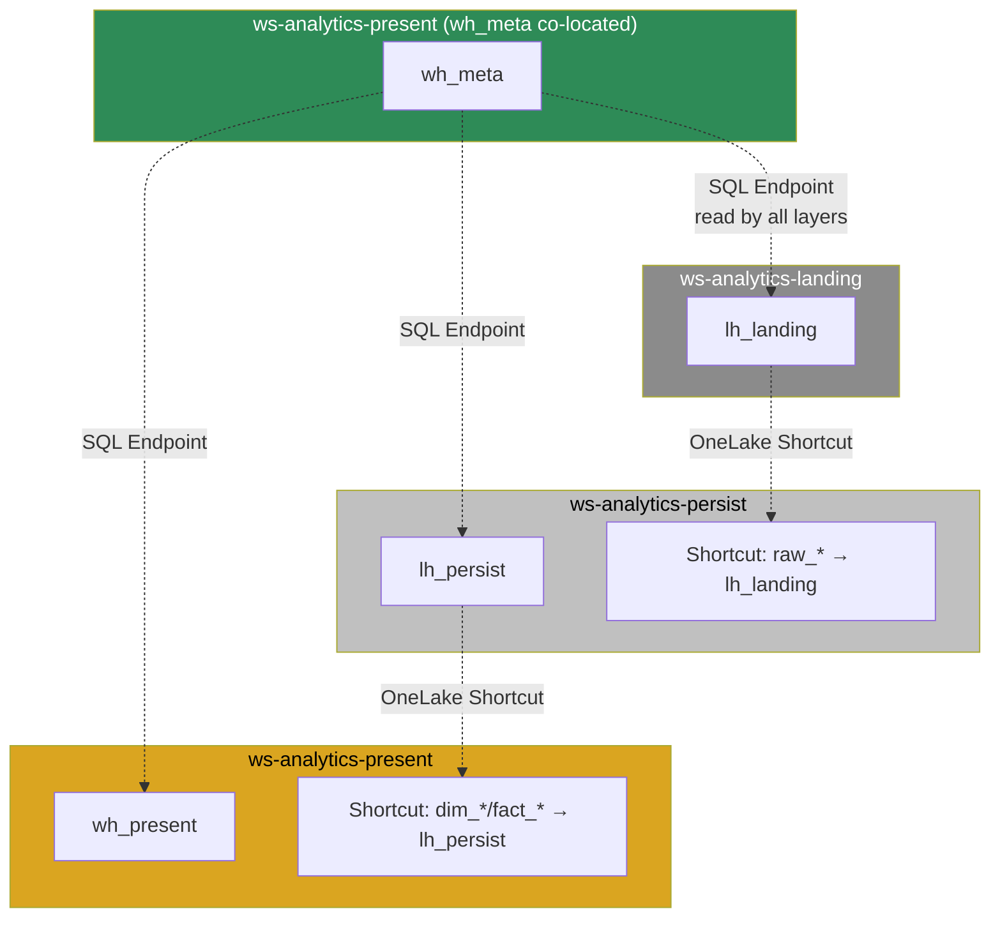
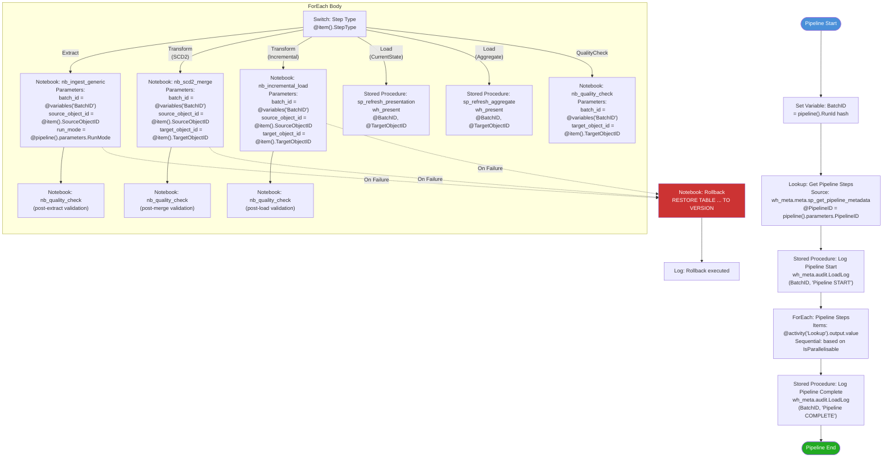

# Fabric Implementation Blueprint — Three-Layer Analytical Platform

> **Version:** 1.0  
> **Date:** 2026-03-13  
> **Source Architecture:** architecture-spec-v1.md (v1.0, 2026-03-13)  
> **Author:** Fabric Modeler Agent  
> **Target Platform:** Microsoft Fabric  

---

## Table of Contents

1. [Executive Summary](#1-executive-summary)
2. [Workspace Layout](#2-workspace-layout)
3. [Fabric Architecture Diagram](#3-fabric-architecture-diagram)
4. [L0 — Landing Layer (Lakehouse)](#4-l0--landing-layer-lakehouse)
5. [L1 — Persistence Layer (Lakehouse)](#5-l1--persistence-layer-lakehouse)
6. [L2 — Presentation Layer (Warehouse)](#6-l2--presentation-layer-warehouse)
7. [Metadata Repository](#7-metadata-repository)
8. [Pipeline Specifications](#8-pipeline-specifications)
9. [Quality Framework](#9-quality-framework)
10. [Rollback & Recovery](#10-rollback--recovery)
11. [Naming Convention Reference](#11-naming-convention-reference)
12. [Modeler-to-Creator Handoff Checklist](#12-modeler-to-creator-handoff-checklist)

---

## 1. Executive Summary

| Property | Value |
|---|---|
| Source Architecture | architecture-spec-v1.md v1.0 |
| Architecture Pattern | Three-Layer (L0 Landing / L1 Persistence / L2 Presentation) |
| Layer Count | 3 data layers + 1 metadata layer |
| Metadata Entities | 12 tables |
| Transformation Rules | 10 (initial library) |
| Connector Types | 4 (SQL Server, DB2, Oracle, File) |
| Pipeline Archetypes | 5 (FullReload, Incremental, SCD2, CurrentState, Aggregate) |
| **Fabric Workspaces** | **4** (landing, persist, present, meta) |
| **Fabric Artifacts** | **15** (2 Lakehouses, 1 Warehouse, 1 Metadata Warehouse, 5 Notebooks, 3 Stored Procedures, 2 Data Pipelines, 1 Shortcut set) |
| **Estimated Capacity** | F4 minimum for development, F8+ for production |

### Architecture Decision Mapping

| Architect ADR | Fabric Implementation |
|---|---|
| ADR-001: Three-layer L0/L1/L2 | L0/L1 → Lakehouse (Delta Lake), L2 → Warehouse (T-SQL) |
| ADR-002: SCD2 for all dims in L1 | PySpark Delta MERGE in `nb_scd2_merge` Notebook |
| ADR-003: Metadata-driven pipeline | `wh_meta` Warehouse + parameterised Notebooks/SPs |
| ADR-004: Pre-load snapshots for rollback | Delta Lake Time Travel (`RESTORE TABLE ... TO VERSION`) |
| ADR-005: Current-state L2 (upgradeable) | T-SQL MERGE in `sp_refresh_presentation` via Shortcut to L1 |

---

## 2. Workspace Layout

### Workspace Inventory

| # | Workspace | Type | Contents | Purpose | Access |
|---|---|---|---|---|---|
| 1 | `ws-analytics-landing` | Production | `lh_landing`, `nb_ingest_generic`, `pl_main_orchestrator` | Raw data ingestion from all sources | Pipeline SP, Data Engineers |
| 2 | `ws-analytics-persist` | Production | `lh_persist`, `nb_scd2_merge`, `nb_incremental_load`, `nb_quality_check` | SCD2 historisation, quality enforcement | Pipeline SP, Data Engineers |
| 3 | `ws-analytics-present` | Production | `wh_present`, `sp_refresh_presentation`, `sp_refresh_aggregate` | Business-ready star schema | Pipeline SP, Analysts, Report Viewers |
| 4 | `ws-analytics-present` | Production | `wh_meta` | Metadata repository, audit log, rollback tracking. **Co-located with `wh_present`** so stored procedures can read metadata and write audit rows using same-workspace three-part naming | Pipeline SP, Platform Team |

### Capacity Assignment

| Workspace | Recommended SKU | Rationale |
|---|---|---|
| `ws-analytics-landing` | F4 (dev) / F8 (prod) | Spark workloads for file parsing, DB extraction |
| `ws-analytics-persist` | F4 (dev) / F8 (prod) | Heavy SCD2 MERGE operations on Delta tables |
| `ws-analytics-present` | F2 (dev) / F4 (prod) | T-SQL workloads, lighter than Spark |
| (`wh_meta` shares `ws-analytics-present`) | — | Small metadata tables, low compute |

---

## 3. Fabric Architecture Diagram



### Cross-Workspace Access Diagram



---

## 4. L0 — Landing Layer (Lakehouse)

### 4.a Storage Artifacts

**Artifact:** `lh_landing` (Lakehouse)  
**Workspace:** `ws-analytics-landing`  
**Format:** Delta Lake  
**Schema Pattern:** One table per SourceObject, prefixed `raw_`

#### Generic L0 Table DDL (Spark SQL)

Every registered SourceObject gets a table following this pattern:

```sql
-- Spark SQL — executed by nb_ingest_generic
CREATE TABLE IF NOT EXISTS lh_landing.raw_{source_object} (
    _BatchID            BIGINT      NOT NULL COMMENT 'Pipeline run batch identifier',
    _LoadTimestamp      TIMESTAMP   NOT NULL COMMENT 'Extraction timestamp',
    _SourceSystem       STRING      NOT NULL COMMENT 'Source system name from metadata',
    _SourceObject       STRING      NOT NULL COMMENT 'Source object name from metadata',
    _FileName           STRING               COMMENT 'Source file path (NULL for DB sources)',
    -- Source columns follow — dynamically generated from SourceObject.SchemaDefinition
    -- All source columns mapped as STRING in L0 (type enforcement deferred to L1)
    {dynamic_source_columns}
)
USING DELTA
COMMENT 'L0 Landing — bit-exact copy from {source_system}.{source_object}'
;
```

#### Delta Properties (L0)

```
delta.parquet.vorder.enabled = true
delta.autoOptimize.optimizeWrite = true
delta.autoOptimize.autoCompact = true
delta.logRetentionDuration = 30 days
delta.deletedFileRetentionDuration = 30 days
```

#### Partition Strategy (L0)

- **Partition by:** `_BatchID` — enables efficient batch-level access and retention management
- **Rationale:** Each pipeline run writes to a single `_BatchID` partition, making full-batch reads and deletions efficient

#### Example: L0 Table for `CUSTOMERS` from Oracle

```sql
CREATE TABLE IF NOT EXISTS lh_landing.raw_customers (
    _BatchID            BIGINT      NOT NULL,
    _LoadTimestamp      TIMESTAMP   NOT NULL,
    _SourceSystem       STRING      NOT NULL,
    _SourceObject       STRING      NOT NULL,
    _FileName           STRING,
    CUST_ID             STRING,
    CUST_NAME           STRING,
    CUST_STATUS         STRING,
    CUST_EMAIL          STRING,
    LAST_MODIFIED       STRING
)
USING DELTA
PARTITIONED BY (_BatchID)
COMMENT 'L0 Landing — bit-exact copy from Oracle_ERP.CUSTOMERS'
;
```

### 4.b Process Specifications

#### Notebook: `nb_ingest_generic`

```
Notebook: nb_ingest_generic
Workspace: ws-analytics-landing
Attached Lakehouse: lh_landing
Language: PySpark
Parameters:
  - batch_id: BIGINT — current batch identifier
  - source_object_id: INT — metadata key for the source being processed
  - run_mode: STRING — 'Full' or 'Incremental'

Purpose: Generic ingestion from any registered source to L0 landing tables.

Logic Summary:
  Step 1: Read metadata from wh_meta via SQL Endpoint
          - Source (ConnectorType, ConnectionString, AuthMethod)
          - SourceObject (ObjectName, IncrementalColumn, WatermarkValue, SchemaDefinition)
  Step 2: Build extraction query dynamically
          - Full: SELECT * FROM {source_object}
          - Incremental: SELECT * WHERE {IncrementalColumn} > {WatermarkValue}
  Step 3: Execute extraction via connector
          - SQL Server / DB2 / Oracle: spark.read.format("jdbc").options(...)
          - Files: spark.read.format({FileFormat}).load({path})
  Step 4: Add system metadata columns (_BatchID, _LoadTimestamp, _SourceSystem, _SourceObject)
  Step 5: Write to lh_landing.raw_{object_name} as Delta (append mode)
  Step 6: Update WatermarkValue in SourceObject metadata (for incremental)
  Step 7: Write audit log entry to wh_meta.audit.LoadLog

Spark Configuration:
  spark.sql.shuffle.partitions = 200
  spark.databricks.delta.optimizeWrite.enabled = true

Input Tables: External source (via JDBC or file read)
Output Tables: lh_landing.raw_{source_object}
Metadata Tables: wh_meta.meta.Source, wh_meta.meta.SourceObject, wh_meta.meta.ConnectorType
```

### 4.c Layer Transition Spec: External → L0

| Property | Value |
|---|---|
| Source | External systems (SQL Server, DB2, Oracle, Files) |
| Target | `lh_landing.raw_{source_object}` |
| Transformation | None — bit-exact copy |
| Access Method | JDBC (databases), File read (CSV/Excel/JSON/Parquet/XML) |
| Artifact | `nb_ingest_generic` (Notebook) or Copy Activity in Pipeline |
| Pattern | FullReload (files, small tables) or Incremental (watermark-based) |

---

## 5. L1 — Persistence Layer (Lakehouse)

### 5.a Storage Artifacts

**Artifact:** `lh_persist` (Lakehouse)  
**Workspace:** `ws-analytics-persist`  
**Format:** Delta Lake  
**Access to L0:** OneLake Shortcut from `lh_landing`

#### L1 Dimension Table DDL (Spark SQL) — SCD2

```sql
-- Spark SQL — table created by nb_scd2_merge on first run
CREATE TABLE IF NOT EXISTS lh_persist.dim_{entity} (
    SK_{Entity}         BIGINT      NOT NULL COMMENT 'Surrogate key — unique per version row',
    BK_{Entity}         STRING      NOT NULL COMMENT 'Business key — stable across versions',
    -- Business attributes (from Mapping metadata, with conformed types)
    {mapped_attribute_1} {spark_type}  {nullable} COMMENT '{description}',
    {mapped_attribute_2} {spark_type}  {nullable} COMMENT '{description}',
    -- SCD2 system columns
    _RowHash            STRING      NOT NULL COMMENT 'SHA-256 of all SCD-tracked attributes',
    _ValidFrom          TIMESTAMP   NOT NULL COMMENT 'Version start timestamp',
    _ValidTo            TIMESTAMP   NOT NULL COMMENT 'Version end (9999-12-31 = current)',
    _IsCurrent          BOOLEAN     NOT NULL COMMENT 'TRUE for the active version',
    _VersionNumber      INT         NOT NULL COMMENT 'Incrementing version counter',
    _IsDeleted          BOOLEAN     NOT NULL COMMENT 'Soft-delete flag',
    _BatchID            BIGINT      NOT NULL COMMENT 'Load batch reference',
    _LoadTimestamp      TIMESTAMP   NOT NULL COMMENT 'Row write timestamp'
)
USING DELTA
COMMENT 'L1 Persistence — SCD2 dimension with full history'
;
```

#### Delta Properties (L1 Dimensions)

```
delta.parquet.vorder.enabled = true
delta.autoOptimize.optimizeWrite = true
delta.autoOptimize.autoCompact = true
delta.logRetentionDuration = 30 days
delta.deletedFileRetentionDuration = 30 days
```

**Z-ORDER:** `BK_{Entity}, _IsCurrent` — Optimises SCD2 lookup (find current row by business key)

#### Example: L1 `dim_customer` from Oracle

```sql
CREATE TABLE IF NOT EXISTS lh_persist.dim_customer (
    SK_Customer         BIGINT      NOT NULL,
    BK_Customer         STRING      NOT NULL,
    CustomerName        STRING,
    Category            STRING,
    CustomerEmail       STRING,
    CustomerStatus      STRING,
    _RowHash            STRING      NOT NULL,
    _ValidFrom          TIMESTAMP   NOT NULL,
    _ValidTo            TIMESTAMP   NOT NULL,
    _IsCurrent          BOOLEAN     NOT NULL,
    _VersionNumber      INT         NOT NULL,
    _IsDeleted          BOOLEAN     NOT NULL,
    _BatchID            BIGINT      NOT NULL,
    _LoadTimestamp      TIMESTAMP   NOT NULL
)
USING DELTA
COMMENT 'L1 Persistence — SCD2 Customer dimension'
;

-- Post-creation optimisation
OPTIMIZE lh_persist.dim_customer ZORDER BY (BK_Customer, _IsCurrent);
```

#### L1 Fact Table DDL (Spark SQL) — Incremental Append

```sql
CREATE TABLE IF NOT EXISTS lh_persist.fact_{entity} (
    SK_{Fact}           BIGINT      NOT NULL COMMENT 'Fact row surrogate key',
    FK_{Dim1}           BIGINT      NOT NULL COMMENT 'FK to dim_{dim1} (current SK)',
    FK_{Dim2}           BIGINT      NOT NULL COMMENT 'FK to dim_{dim2} (current SK)',
    -- Degenerate dimensions
    DD_{DegDim}         STRING               COMMENT 'Degenerate dimension (e.g. InvoiceNumber)',
    -- Measures
    M_{Measure1}        DECIMAL(18,2)        COMMENT 'Additive measure',
    M_{Measure2}        DECIMAL(18,4)        COMMENT 'Semi-additive/non-additive measure',
    -- Audit columns
    _BatchID            BIGINT      NOT NULL,
    _LoadTimestamp      TIMESTAMP   NOT NULL
)
USING DELTA
COMMENT 'L1 Persistence — incremental fact table'
;
```

**Partition Strategy (L1 Facts):** Partition by date dimension FK column (e.g., `FK_Date`) for efficient date-range scans.  
**Z-ORDER (L1 Facts):** Z-ORDER by highest-cardinality FK for join performance.

### 5.b Process Specifications

#### Notebook: `nb_scd2_merge`

```
Notebook: nb_scd2_merge
Workspace: ws-analytics-persist
Attached Lakehouse: lh_persist
Language: PySpark
Parameters:
  - batch_id: BIGINT — current batch identifier
  - source_object_id: INT — L0 source object metadata key
  - target_object_id: INT — L1 target object metadata key

Purpose: Generic SCD2 merge — reads L0 batch, applies transformations from
         metadata, computes RowHash, merges into L1 dimension using Delta MERGE.

Logic Summary:
  Step 1: Read metadata from wh_meta (Mapping, TransformationRule, TargetObject)
  Step 2: Read L0 batch via Shortcut: lh_persist.raw_{source_object} WHERE _BatchID = {batch_id}
  Step 3: Build dynamic SELECT with transformation injection
          - For each Mapping row:
            - If TransformationRuleID is set → inject RuleCode with column substitution
            - Else → direct column rename (SourceColumn AS TargetColumn)
  Step 4: Compute _RowHash = SHA2(CONCAT_WS('||', {all_scd_tracked_columns}), 256)
  Step 5: Read current L1 target: lh_persist.dim_{entity} WHERE _IsCurrent = true
  Step 6: Execute Delta Lake MERGE:
          - MATCH condition: src.BK = tgt.BK AND tgt._IsCurrent = true
          - WHEN MATCHED AND tgt._RowHash != src._RowHash:
              UPDATE SET _IsCurrent = false, _ValidTo = current_timestamp()
          - WHEN NOT MATCHED:
              INSERT all columns with _IsCurrent = true, _ValidFrom = now,
              _ValidTo = '9999-12-31', _VersionNumber = 1
  Step 7: INSERT new versions for changed rows (separate operation):
          - Join source with expired target rows to get new VersionNumber = prev + 1
  Step 8: Handle soft deletes:
          - L1 rows with _IsCurrent = true whose BK is NOT in source batch
          - UPDATE: _IsCurrent = false, _ValidTo = now, _IsDeleted = true
  Step 9: Write audit log entry to wh_meta.audit.LoadLog (inserts, updates, deletes)
  Step 10: Invoke nb_quality_check for this target

Spark Configuration:
  spark.sql.shuffle.partitions = 200
  spark.databricks.delta.optimizeWrite.enabled = true

Input Tables: lh_persist.raw_{source_object} (via Shortcut from lh_landing)
Output Tables: lh_persist.dim_{entity}
Metadata Tables: wh_meta.meta.Mapping, wh_meta.meta.TransformationRule, wh_meta.meta.TargetObject
```

**SCD2 Merge — PySpark Implementation (Creator-Ready Pseudocode):**

```python
from delta.tables import DeltaTable
from pyspark.sql.functions import sha2, concat_ws, lit, current_timestamp, col, coalesce, max as spark_max

# --- Parameters (from Pipeline) ---
batch_id = dbutils.widgets.get("batch_id")
source_object_id = dbutils.widgets.get("source_object_id")
target_object_id = dbutils.widgets.get("target_object_id")

# --- Step 1: Read metadata ---
meta_jdbc = "jdbc:sqlserver://{wh_meta_endpoint};database=wh_meta"
mappings = spark.read.jdbc(meta_jdbc, "meta.Mapping",
    properties={"query": f"SELECT * FROM meta.Mapping WHERE SourceObjectID={source_object_id} AND TargetObjectID={target_object_id}"})
rules = spark.read.jdbc(meta_jdbc, "meta.TransformationRule")
target_obj = spark.read.jdbc(meta_jdbc, "meta.TargetObject",
    properties={"query": f"SELECT * FROM meta.TargetObject WHERE TargetObjectID={target_object_id}"}).first()

entity_name = target_obj["ObjectName"]  # e.g. "dim_customer"
bk_columns = target_obj["BusinessKeyColumns"].split(",")  # e.g. ["BK_Customer"]

# --- Step 2: Read L0 batch (via Shortcut) ---
source_obj_name = spark.read.jdbc(meta_jdbc, "meta.SourceObject",
    properties={"query": f"SELECT ObjectName FROM meta.SourceObject WHERE SourceObjectID={source_object_id}"}).first()[0]
source_df = spark.read.table(f"lh_persist.raw_{source_obj_name}").filter(f"_BatchID = {batch_id}")

# --- Step 3: Dynamic transformation SELECT ---
select_exprs = []
scd_tracked_cols = []
for row in mappings.collect():
    rule_id = row["TransformationRuleID"]
    src_col = row["SourceColumn"]
    tgt_col = row["TargetColumn"]
    if rule_id:
        rule = rules.filter(f"RuleID = {rule_id}").first()
        if rule and rule["RuleType"] != "DirectCopy":
            expr = rule["RuleCode"].replace("{source_column}", src_col)
            for p in (rule["Parameters"] or "").split(","):
                if "=" in p:
                    k, v = p.split("=", 1)
                    expr = expr.replace("{" + k.strip() + "}", v.strip())
            select_exprs.append(f"{expr} AS {tgt_col}")
        else:
            select_exprs.append(f"{src_col} AS {tgt_col}")
    else:
        select_exprs.append(f"{src_col} AS {tgt_col}")
    if row["IsSCDTracked"]:
        scd_tracked_cols.append(tgt_col)

transformed_df = source_df.selectExpr(*select_exprs)

# --- Step 4: Compute _RowHash ---
transformed_df = transformed_df.withColumn(
    "_RowHash", sha2(concat_ws("||", *[col(c) for c in scd_tracked_cols]), 256)
)

# --- Step 5: Read current L1 ---
target_table = DeltaTable.forName(spark, f"lh_persist.{entity_name}")
target_df = target_table.toDF().filter("_IsCurrent = true")

# Record pre-merge version for rollback
pre_merge_version = spark.sql(f"DESCRIBE HISTORY lh_persist.{entity_name} LIMIT 1").first()["version"]

# --- Step 6-8: MERGE (new + changed + deleted) ---
bk_condition = " AND ".join([f"tgt.{bk} = src.{bk}" for bk in bk_columns])
merge_condition = f"{bk_condition} AND tgt._IsCurrent = true"

# ... (Creator Agent implements full MERGE + insert-new-versions + soft-delete logic)

# --- Step 9: Audit log ---
# INSERT INTO wh_meta.audit.LoadLog (BatchID, StepID, RowsInserted, RowsUpdated, RowsDeleted, Status, ...)
```

#### Notebook: `nb_incremental_load`

```
Notebook: nb_incremental_load
Workspace: ws-analytics-persist
Attached Lakehouse: lh_persist
Language: PySpark
Parameters:
  - batch_id: BIGINT
  - source_object_id: INT
  - target_object_id: INT

Purpose: Generic incremental fact load — reads L0 batch, resolves dimension FKs,
         appends to L1 fact table.

Logic Summary:
  Step 1: Read mappings + TransformationRules from wh_meta
  Step 2: Read L0 batch via Shortcut
  Step 3: Apply column transformations from metadata
  Step 4: Resolve dimension surrogate keys via LookupDimSK rule
          - For each FK column: join on BK with dim table WHERE _IsCurrent = true
          - Late-arriving dimensions: insert placeholder row if BK not found
  Step 5: Generate SK (monotonically_increasing_id or from metadata sequence)
  Step 6: Append to lh_persist.fact_{entity} (Delta write mode = append)
  Step 7: Update watermark in wh_meta.meta.SourceObject
  Step 8: Write audit log

Input Tables: lh_persist.raw_{source_object} (via Shortcut), lh_persist.dim_* (for FK lookup)
Output Tables: lh_persist.fact_{entity}
Metadata Tables: wh_meta.meta.Mapping, wh_meta.meta.TransformationRule
```

#### Notebook: `nb_quality_check`

```
Notebook: nb_quality_check
Workspace: ws-analytics-persist
Attached Lakehouse: lh_persist
Language: PySpark
Parameters:
  - batch_id: BIGINT
  - target_object_id: INT

Purpose: Execute quality rules from metadata for a given target object after loading.

Logic Summary:
  Step 1: Read QualityRule rows from wh_meta for target_object_id
  Step 2: For each rule, evaluate against the target table:
          - NotNull: SELECT COUNT(*) WHERE {column} IS NULL
          - Unique: SELECT {columns}, COUNT(*) GROUP BY ... HAVING COUNT(*) > 1
          - Range: SELECT COUNT(*) WHERE NOT ({expression})
          - FK: SELECT COUNT(*) WHERE {fk} NOT IN (SELECT {pk} FROM {ref_table})
          - RowCount: Compare actual vs expected threshold
  Step 3: Log result per rule to wh_meta.audit.LoadLog
  Step 4: If any rule with Severity = 'Rollback' fails:
          - Trigger Delta RESTORE on the target table
          - Raise exception to pipeline for error handling

Input Tables: lh_persist.{target_table}
Output Tables: None (reads only)
Metadata Tables: wh_meta.meta.QualityRule, wh_meta.audit.LoadLog
```

### 5.c Layer Transition Spec: L0 → L1

| Property | Value |
|---|---|
| Source | `lh_landing.raw_{source_object}` (via OneLake Shortcut into `lh_persist`) |
| Target (dimensions) | `lh_persist.dim_{entity}` |
| Target (facts) | `lh_persist.fact_{entity}` |
| Transformation | Metadata-driven: TransformationRule injection from `wh_meta` |
| Access Method | OneLake Shortcut (zero-copy, read-only) |
| Dimension Pattern | SCD2 via Delta MERGE (`nb_scd2_merge`) |
| Fact Pattern | Incremental append with FK resolution (`nb_incremental_load`) |
| Quality Gate | `nb_quality_check` post-load |

---

## 6. L2 — Presentation Layer (Warehouse)

### 6.a Storage Artifacts

**Artifact:** `wh_present` (Warehouse)  
**Workspace:** `ws-analytics-present`  
**Engine:** T-SQL  
**Access to L1:** OneLake Shortcut from `lh_persist`  
**Schemas:** `present` (business tables), `shortcut` (Shortcuts to L1)

#### L2 Dimension Table DDL (T-SQL)

```sql
CREATE SCHEMA [present];
GO

CREATE TABLE [present].[dim_customer] (
    SK_Customer             BIGINT          NOT NULL,
    BK_Customer             VARCHAR(50)     NOT NULL,
    CustomerName            VARCHAR(200)    NULL,
    Category                VARCHAR(100)    NULL,
    CustomerEmail           VARCHAR(200)    NULL,
    CustomerStatus          VARCHAR(20)     NULL,
    _LastRefreshTimestamp    DATETIME2(3)    NOT NULL
);

ALTER TABLE [present].[dim_customer]
    ADD CONSTRAINT PK_dim_customer PRIMARY KEY NONCLUSTERED (SK_Customer) NOT ENFORCED;

GO
```

#### L2 Fact Table DDL (T-SQL)

```sql
CREATE TABLE [present].[fact_sales] (
    SK_Sales                BIGINT          NOT NULL,
    FK_Customer             BIGINT          NOT NULL,
    FK_Product              BIGINT          NOT NULL,
    FK_Date                 BIGINT          NOT NULL,
    DD_InvoiceNumber        VARCHAR(50)     NULL,
    M_SalesAmount           DECIMAL(18,2)   NULL,
    M_Quantity              INT             NULL,
    M_Discount              DECIMAL(5,2)    NULL,
    _LastRefreshTimestamp    DATETIME2(3)    NOT NULL
);

ALTER TABLE [present].[fact_sales]
    ADD CONSTRAINT PK_fact_sales PRIMARY KEY NONCLUSTERED (SK_Sales) NOT ENFORCED;

GO
```

#### L2 Aggregate Table DDL (T-SQL)

```sql
CREATE TABLE [present].[agg_sales_monthly] (
    FK_Customer             BIGINT          NOT NULL,
    FK_Product              BIGINT          NOT NULL,
    YearMonth               INT             NOT NULL,   -- YYYYMM
    M_TotalSalesAmount      DECIMAL(18,2)   NULL,
    M_TotalQuantity         INT             NULL,
    M_TransactionCount      INT             NULL,
    _LastRefreshTimestamp    DATETIME2(3)    NOT NULL
);

ALTER TABLE [present].[agg_sales_monthly]
    ADD CONSTRAINT PK_agg_sales_monthly PRIMARY KEY NONCLUSTERED (FK_Customer, FK_Product, YearMonth) NOT ENFORCED;
GO
```

### 6.b Process Specifications

#### Stored Procedure: `sp_refresh_presentation`

```
Stored Procedure: sp_refresh_presentation
Warehouse: wh_present
Schema: [present]
Parameters:
  @BatchID BIGINT,
  @TargetObjectID INT

Purpose: Generic current-state projection — reads L1 dimension/fact via Shortcut,
         MERGEs into L2 presentation table.

Logic Summary:
  Step 1: Read TargetObject metadata (ObjectName, BusinessKeyColumns, LoadPattern)
          from wh_meta via cross-database query
  Step 2: Build dynamic MERGE statement:
          MERGE INTO [present].[{ObjectName}] AS tgt
          USING (
              SELECT {all_mapped_columns}
              FROM [lh_bridge].[dbo].[{ObjectName}]
              WHERE _IsCurrent = 1 AND _IsDeleted = 0
          ) AS src
          ON tgt.{BusinessKeyColumns} = src.{BusinessKeyColumns}
          WHEN MATCHED THEN UPDATE SET ...all columns..., _LastRefreshTimestamp = GETDATE()
          WHEN NOT MATCHED BY TARGET THEN INSERT ...
          WHEN NOT MATCHED BY SOURCE THEN DELETE
  Step 3: Write audit log entry to wh_meta.audit.LoadLog
  Step 4: Return row count and status

Cross-Workspace Access:
  - Reads from: lh_persist via OneLake Shortcuts hosted in the bridge Lakehouse [lh_bridge] in ws-analytics-present (shortcuts cannot be created inside a Warehouse)
  - Reads metadata from: wh_meta via cross-database query

Error Handling:
  TRY/CATCH with THROW, log error to wh_meta.audit.LoadLog
```

**T-SQL Implementation (Creator-Ready):**

```sql
CREATE PROCEDURE [present].[sp_refresh_presentation]
    @BatchID BIGINT,
    @TargetObjectID INT
AS
BEGIN
    SET NOCOUNT ON;
    
    DECLARE @ObjectName VARCHAR(200);
    DECLARE @BKColumns VARCHAR(500);
    DECLARE @RowsInserted INT = 0;
    DECLARE @RowsUpdated INT = 0;
    DECLARE @RowsDeleted INT = 0;
    DECLARE @StartTime DATETIME2(3) = GETDATE();
    
    BEGIN TRY
        -- Step 1: Read metadata
        SELECT @ObjectName = ObjectName, @BKColumns = BusinessKeyColumns
        FROM [wh_meta].[meta].[TargetObject]
        WHERE TargetObjectID = @TargetObjectID;

        -- Step 2: Dynamic MERGE (example for dim_customer)
        -- Creator Agent generates dynamic SQL per TargetObject
        MERGE INTO [present].[dim_customer] AS tgt
        USING (
            SELECT SK_Customer, BK_Customer, CustomerName, Category,
                   CustomerEmail, CustomerStatus
            FROM [lh_bridge].[dbo].[dim_customer]
            WHERE _IsCurrent = 1 AND _IsDeleted = 0
        ) AS src
        ON tgt.BK_Customer = src.BK_Customer
        WHEN MATCHED THEN
            UPDATE SET
                tgt.SK_Customer = src.SK_Customer,
                tgt.CustomerName = src.CustomerName,
                tgt.Category = src.Category,
                tgt.CustomerEmail = src.CustomerEmail,
                tgt.CustomerStatus = src.CustomerStatus,
                tgt._LastRefreshTimestamp = GETDATE()
        WHEN NOT MATCHED BY TARGET THEN
            INSERT (SK_Customer, BK_Customer, CustomerName, Category,
                    CustomerEmail, CustomerStatus, _LastRefreshTimestamp)
            VALUES (src.SK_Customer, src.BK_Customer, src.CustomerName, src.Category,
                    src.CustomerEmail, src.CustomerStatus, GETDATE())
        WHEN NOT MATCHED BY SOURCE THEN
            DELETE;
        
        SET @RowsInserted = @@ROWCOUNT;  -- simplified; Creator splits counts

        -- Step 3: Audit log
        INSERT INTO [wh_meta].[audit].[LoadLog]
            (BatchID, PipelineID, TargetObjectID, OperationType, StartTime, EndTime,
             RowsInserted, RowsUpdated, RowsDeleted, Status)
        VALUES
            (@BatchID, NULL, @TargetObjectID, 'Load', @StartTime, GETDATE(),
             @RowsInserted, @RowsUpdated, @RowsDeleted, 'Success');
    
    END TRY
    BEGIN CATCH
        INSERT INTO [wh_meta].[audit].[LoadLog]
            (BatchID, TargetObjectID, OperationType, StartTime, EndTime, Status, ErrorMessage)
        VALUES
            (@BatchID, @TargetObjectID, 'Load', @StartTime, GETDATE(), 'Failed', ERROR_MESSAGE());
        THROW;
    END CATCH
END;
GO
```

#### Stored Procedure: `sp_refresh_aggregate`

```
Stored Procedure: sp_refresh_aggregate
Warehouse: wh_present
Schema: [present]
Parameters:
  @BatchID BIGINT,
  @TargetObjectID INT

Purpose: Rebuild aggregate table from L2 fact + dimension tables.

Logic Summary:
  Step 1: Read aggregate definition from metadata (source fact, group-by columns, measures)
  Step 2: Truncate and rebuild aggregate table:
          INSERT INTO [present].[agg_{name}]
          SELECT {group_columns}, SUM/COUNT/AVG({measures}), GETDATE()
          FROM [present].[fact_{source}]
          JOIN [present].[dim_{dim}] ON FK = SK
          GROUP BY {group_columns}
  Step 3: Write audit log

Error Handling: TRY/CATCH with log and THROW
```

### 6.c Layer Transition Spec: L1 → L2

| Property | Value |
|---|---|
| Source | `lh_persist.dim_*` / `lh_persist.fact_*` via OneLake Shortcuts in the bridge Lakehouse `lh_bridge` (ws-analytics-present) |
| Target | `wh_present.[present].[dim_*]` / `[present].[fact_*]` / `[present].[agg_*]` |
| Dimension Pattern | CurrentState MERGE (`sp_refresh_presentation`): `WHERE _IsCurrent = 1 AND _IsDeleted = 0` |
| Fact Pattern | CurrentState MERGE or full rebuild |
| Aggregate Pattern | Truncate + rebuild (`sp_refresh_aggregate`) |
| Access Method | OneLake Shortcuts hosted in `lh_bridge` (a Lakehouse); `wh_present` reads them by same-workspace three-part naming |
| Future Upgrade | Change LoadPattern from `CurrentState` to `SCD2` in metadata → automated |

---

## 7. Metadata Repository

### Physical Location

| Property | Value |
|---|---|
| Artifact | Warehouse (`wh_meta`) |
| Workspace | `ws-analytics-present` (co-located with `wh_present`) |
| Schemas | `meta` (12 metadata tables), `audit` (LoadLog, RollbackSnapshot) |
| Access | Stored procedures in `wh_present` use same-workspace three-part naming. Notebooks in other workspaces read via JDBC against the TDS endpoint — Spark SQL name resolution does not cross workspaces |

### Full T-SQL DDL

```sql
-- =====================================================
-- METADATA REPOSITORY — Full DDL for wh_meta
-- =====================================================

CREATE SCHEMA [meta];
GO
CREATE SCHEMA [audit];
GO

-- ----- 1. ConnectorType -----
CREATE TABLE [meta].[ConnectorType] (
    ConnectorTypeID     INT             NOT NULL,
    ConnectorName       VARCHAR(50)     NOT NULL,
    DriverClass         VARCHAR(200)    NULL,
    ConnectionTemplate  VARCHAR(500)    NULL,
    IncrementalStrategy VARCHAR(50)     NULL
);

ALTER TABLE [meta].[ConnectorType]
    ADD CONSTRAINT PK_ConnectorType PRIMARY KEY NONCLUSTERED (ConnectorTypeID) NOT ENFORCED;

-- ----- 2. Source -----
CREATE TABLE [meta].[Source] (
    SourceID            INT             NOT NULL IDENTITY(1,1),
    ConnectorTypeID     INT             NOT NULL,
    SourceName          VARCHAR(100)    NOT NULL,
    ConnectionString    VARCHAR(500)    NOT NULL,
    AuthMethod          VARCHAR(50)     NOT NULL,
    DefaultSchema       VARCHAR(100)    NULL,
    IsActive            BIT             NOT NULL DEFAULT 1
);

ALTER TABLE [meta].[Source]
    ADD CONSTRAINT PK_Source PRIMARY KEY NONCLUSTERED (SourceID) NOT ENFORCED;

-- ----- 3. SourceObject -----
CREATE TABLE [meta].[SourceObject] (
    SourceObjectID      INT             NOT NULL IDENTITY(1,1),
    SourceID            INT             NOT NULL,
    ObjectName          VARCHAR(200)    NOT NULL,
    ObjectType          VARCHAR(50)     NOT NULL,   -- Table, View, File
    FileFormat          VARCHAR(20)     NULL,        -- CSV, Excel, JSON, Parquet, XML
    FileDelimiter       VARCHAR(5)      NULL,
    IncrementalColumn   VARCHAR(100)    NULL,
    WatermarkValue      DATETIME2(3)    NULL,
    PrimaryKeyColumns   VARCHAR(500)    NOT NULL,
    SchemaDefinition    VARCHAR(MAX)    NULL,        -- JSON schema of source columns
    IsActive            BIT             NOT NULL DEFAULT 1
);

ALTER TABLE [meta].[SourceObject]
    ADD CONSTRAINT PK_SourceObject PRIMARY KEY NONCLUSTERED (SourceObjectID) NOT ENFORCED;

-- ----- 4. Target -----
CREATE TABLE [meta].[Target] (
    TargetID            INT             NOT NULL IDENTITY(1,1),
    LayerName           VARCHAR(20)     NOT NULL,   -- L0, L1, L2
    TargetSchema        VARCHAR(100)    NOT NULL,
    ConnectionType      VARCHAR(50)     NOT NULL,   -- Lakehouse, Warehouse
);

ALTER TABLE [meta].[Target]
    ADD CONSTRAINT PK_Target PRIMARY KEY NONCLUSTERED (TargetID) NOT ENFORCED;

-- ----- 5. TargetObject -----
CREATE TABLE [meta].[TargetObject] (
    TargetObjectID      INT             NOT NULL IDENTITY(1,1),
    TargetID            INT             NOT NULL,
    ObjectName          VARCHAR(200)    NOT NULL,
    ObjectType          VARCHAR(50)     NOT NULL,   -- Raw, Dimension, Fact, Aggregate
    LoadPattern         VARCHAR(50)     NOT NULL,   -- FullReload, Incremental, SCD2, CurrentState, Aggregate
    BusinessKeyColumns  VARCHAR(500)    NULL,
    PartitionColumn     VARCHAR(100)    NULL,
    RollbackStrategy    VARCHAR(50)     NULL,        -- DeltaTimeTravel, Reprocess
    IsActive            BIT             NOT NULL DEFAULT 1
);

ALTER TABLE [meta].[TargetObject]
    ADD CONSTRAINT PK_TargetObject PRIMARY KEY NONCLUSTERED (TargetObjectID) NOT ENFORCED;

-- ----- 6. Mapping -----
CREATE TABLE [meta].[Mapping] (
    MappingID           INT             NOT NULL IDENTITY(1,1),
    SourceObjectID      INT             NOT NULL,
    TargetObjectID      INT             NOT NULL,
    SourceColumn        VARCHAR(200)    NOT NULL,
    TargetColumn        VARCHAR(200)    NOT NULL,
    TransformationRuleID INT           NULL,
    OrdinalPosition     INT             NOT NULL,
    IsSCDTracked        BIT             NOT NULL DEFAULT 0,
    IsActive            BIT             NOT NULL DEFAULT 1
);

ALTER TABLE [meta].[Mapping]
    ADD CONSTRAINT PK_Mapping PRIMARY KEY NONCLUSTERED (MappingID) NOT ENFORCED;

-- ----- 7. TransformationRule -----
CREATE TABLE [meta].[TransformationRule] (
    RuleID              INT             NOT NULL IDENTITY(1,1),
    RuleName            VARCHAR(100)    NOT NULL,
    RuleType            VARCHAR(50)     NOT NULL,   -- DirectCopy, SQL, Expression, Lookup, HashKey, Conditional, SurrogateKey
    RuleCode            VARCHAR(MAX)    NULL,
    Parameters          VARCHAR(500)    NULL,
    Description         VARCHAR(500)    NULL
);

ALTER TABLE [meta].[TransformationRule]
    ADD CONSTRAINT PK_TransformationRule PRIMARY KEY NONCLUSTERED (RuleID) NOT ENFORCED;

-- ----- 8. Pipeline -----
CREATE TABLE [meta].[Pipeline] (
    PipelineID          INT             NOT NULL IDENTITY(1,1),
    PipelineName        VARCHAR(200)    NOT NULL,
    PipelineType        VARCHAR(50)     NOT NULL,   -- Main, Sub, Maintenance
    ScheduleCron        VARCHAR(50)     NULL,
    DependsOnPipelineIDs VARCHAR(200)   NULL,
    ErrorHandling       VARCHAR(50)     NOT NULL DEFAULT 'StopOnError',
    IsActive            BIT             NOT NULL DEFAULT 1
);

ALTER TABLE [meta].[Pipeline]
    ADD CONSTRAINT PK_Pipeline PRIMARY KEY NONCLUSTERED (PipelineID) NOT ENFORCED;

-- ----- 9. PipelineStep -----
CREATE TABLE [meta].[PipelineStep] (
    StepID              INT             NOT NULL IDENTITY(1,1),
    PipelineID          INT             NOT NULL,
    StepOrder           INT             NOT NULL,
    StepType            VARCHAR(50)     NOT NULL,   -- Extract, Transform, Load, QualityCheck
    SourceObjectID      INT             NULL,
    TargetObjectID      INT             NULL,
    LoadPattern         VARCHAR(50)     NULL,
    IsParallelisable    BIT             NOT NULL DEFAULT 0
);

ALTER TABLE [meta].[PipelineStep]
    ADD CONSTRAINT PK_PipelineStep PRIMARY KEY NONCLUSTERED (StepID) NOT ENFORCED;

-- ----- 10. QualityRule -----
CREATE TABLE [meta].[QualityRule] (
    QualityRuleID       INT             NOT NULL IDENTITY(1,1),
    TargetObjectID      INT             NOT NULL,
    RuleName            VARCHAR(200)    NOT NULL,
    RuleType            VARCHAR(50)     NOT NULL,   -- NotNull, Unique, Range, FK, RowCount
    RuleExpression      VARCHAR(MAX)    NOT NULL,
    Severity            VARCHAR(20)     NOT NULL,   -- Warn, Fail, Rollback
);

ALTER TABLE [meta].[QualityRule]
    ADD CONSTRAINT PK_QualityRule PRIMARY KEY NONCLUSTERED (QualityRuleID) NOT ENFORCED;

-- ----- 11. LoadLog (Audit) -----
CREATE TABLE [audit].[LoadLog] (
    LogID               BIGINT          NOT NULL IDENTITY(1,1),
    BatchID             BIGINT          NOT NULL,
    PipelineID          INT             NULL,
    StepID              INT             NULL,
    SourceObjectID      INT             NULL,
    TargetObjectID      INT             NULL,
    OperationType       VARCHAR(50)     NOT NULL,
    StartTime           DATETIME2(3)    NOT NULL,
    EndTime             DATETIME2(3)    NULL,
    RowsRead            BIGINT          NULL DEFAULT 0,
    RowsInserted        BIGINT          NULL DEFAULT 0,
    RowsUpdated         BIGINT          NULL DEFAULT 0,
    RowsDeleted         BIGINT          NULL DEFAULT 0,
    RowsRejected        BIGINT          NULL DEFAULT 0,
    Status              VARCHAR(20)     NOT NULL,   -- Running, Success, Warning, Failed, RolledBack
    ErrorMessage        VARCHAR(MAX)    NULL,
    QualityRuleName     VARCHAR(200)    NULL,
    SnapshotID          BIGINT          NULL,
    ExecutionContext     VARCHAR(MAX)    NULL,
    Operator            VARCHAR(100)    NULL DEFAULT SYSTEM_USER
);

ALTER TABLE [audit].[LoadLog]
    ADD CONSTRAINT PK_LoadLog PRIMARY KEY NONCLUSTERED (LogID) NOT ENFORCED;


-- ----- 12. RollbackSnapshot (Audit) -----
CREATE TABLE [audit].[RollbackSnapshot] (
    SnapshotID          BIGINT          NOT NULL IDENTITY(1,1),
    BatchID             BIGINT          NOT NULL,
    TargetObjectID      INT             NOT NULL,
    SnapshotTimestamp   DATETIME2(3)    NOT NULL DEFAULT GETDATE(),
    SnapshotType        VARCHAR(50)     NOT NULL DEFAULT 'DeltaVersion',
    SnapshotLocation    VARCHAR(500)    NOT NULL,   -- Delta version number or path
    Status              VARCHAR(20)     NOT NULL DEFAULT 'Active',  -- Active, Applied, Expired
);

ALTER TABLE [audit].[RollbackSnapshot]
    ADD CONSTRAINT PK_RollbackSnapshot PRIMARY KEY NONCLUSTERED (SnapshotID) NOT ENFORCED;

GO
```

### Seed Data

```sql
-- === ConnectorType Seed ===
INSERT INTO [meta].[ConnectorType] (ConnectorTypeID, ConnectorName, DriverClass, ConnectionTemplate, IncrementalStrategy) VALUES
(1, 'SQL Server', 'com.microsoft.sqlserver.jdbc.SQLServerDriver', 'jdbc:sqlserver://{host}:{port};databaseName={database}', 'Watermark'),
(2, 'IBM DB2',    'com.ibm.db2.jcc.DB2Driver',                   'jdbc:db2://{host}:{port}/{database}',                    'Watermark'),
(3, 'Oracle',     'oracle.jdbc.OracleDriver',                     'jdbc:oracle:thin:@{host}:{port}:{sid}',                  'Watermark'),
(4, 'File',       NULL,                                           '{path}/{pattern}',                                        'FullReload');

-- === Target Seed (one per layer) ===
SET IDENTITY_INSERT [meta].[Target] ON;
INSERT INTO [meta].[Target] (TargetID, LayerName, TargetSchema, ConnectionType) VALUES
(1, 'L0', 'dbo',      'Lakehouse'),
(2, 'L1', 'dbo',      'Lakehouse'),
(3, 'L2', 'present',  'Warehouse');
SET IDENTITY_INSERT [meta].[Target] OFF;

-- === TransformationRule Seed ===
SET IDENTITY_INSERT [meta].[TransformationRule] ON;
INSERT INTO [meta].[TransformationRule] (RuleID, RuleName, RuleType, RuleCode, Parameters, Description) VALUES
(1,  'DirectCopy',       'DirectCopy',   NULL,                                                                            NULL,              '1:1 column mapping, no transformation'),
(2,  'TrimUpperCase',    'SQL',          'UPPER(TRIM({source_column}))',                                                   NULL,              'Standardise text to upper-trimmed'),
(3,  'NullToDefault',    'SQL',          'COALESCE({source_column}, {param1})',                                            'param1=N/A',      'Replace NULL with default value'),
(4,  'DateParse',        'SQL',          'CAST({source_column} AS DATE)',                                                  NULL,              'Parse string to date'),
(5,  'CompositeKey',     'Expression',   'CONCAT({col_a}, ''|'', {col_b})',                                                NULL,              'Build composite business key'),
(6,  'LookupDimSK',      'Lookup',       '{dim_table}:{bk_column}:{sk_column}',                                           NULL,              'Resolve dimension surrogate key'),
(7,  'HashRow',          'HashKey',      'HASH({col_a}, {col_b}, ..., {col_n})',                                           NULL,              'Compute hash for SCD detection'),
(8,  'ConditionalMap',   'Conditional',  'CASE WHEN {source_column}=''A'' THEN ''Active'' ELSE ''Inactive'' END',          NULL,              'Code-to-description mapping'),
(9,  'SurrogateKey',     'SurrogateKey', 'NEXT_SEQUENCE(''{target_table}_seq'')',                                           NULL,              'Generate surrogate key'),
(10, 'NumericConvert',   'SQL',          'CAST({source_column} AS DECIMAL({param1},{param2}))',                             'param1=18,param2=2', 'String to decimal conversion');
SET IDENTITY_INSERT [meta].[TransformationRule] OFF;

-- === Pipeline Seed ===
SET IDENTITY_INSERT [meta].[Pipeline] ON;
INSERT INTO [meta].[Pipeline] (PipelineID, PipelineName, PipelineType, ScheduleCron, ErrorHandling, IsActive) VALUES
(1, 'pl_main_orchestrator', 'Main', '0 2 * * *', 'StopOnError', 1);
SET IDENTITY_INSERT [meta].[Pipeline] OFF;
```

### Stored Procedure: `sp_get_pipeline_metadata`

```
Stored Procedure: sp_get_pipeline_metadata
Warehouse: wh_meta
Schema: [meta]
Parameters:
  @PipelineID INT

Purpose: Return all pipeline steps with joined source/target/mapping metadata
         for the generic pipeline engine to consume.

Returns: Result set with columns:
  StepID, StepOrder, StepType, LoadPattern, IsParallelisable,
  SourceObjectID, SourceName, ObjectName, ConnectorTypeID, ConnectionString,
  IncrementalColumn, WatermarkValue,
  TargetObjectID, TargetObjectName, TargetLayerName, BusinessKeyColumns, RollbackStrategy
```

---

## 8. Pipeline Specifications

### Pipeline: `pl_main_orchestrator`

```
Pipeline: pl_main_orchestrator
Workspace: ws-analytics-landing
Type: Data Pipeline

Parameters:
  - PipelineID: INT (default: 1)
  - RunMode: STRING ('Full' | 'Incremental' | 'Reprocess')
  - BatchID: BIGINT (auto-generated if not provided)
```

#### Pipeline Activity Diagram



#### Activity Specification Table

| # | Activity Name | Type | Description | Depends On | On Failure |
|---|---|---|---|---|---|
| 1 | Set_BatchID | Set Variable | Generate BatchID from pipeline run ID | — | Fail pipeline |
| 2 | Lookup_PipelineSteps | Lookup | Call `sp_get_pipeline_metadata(@PipelineID)` in `wh_meta` | 1 | Fail pipeline |
| 3 | Log_PipelineStart | Stored Procedure | Insert 'Pipeline START' into `LoadLog` | 2 | Fail pipeline |
| 4 | ForEach_Step | ForEach | Loop over pipeline steps from Lookup output | 3 | — |
| 4a | Switch_StepType | Switch (inside ForEach) | Branch by `StepType` | — | Log + Rollback |
| 4a.1 | Run_Extract | Notebook (`nb_ingest_generic`) | Generic ingestion to L0 | — | Rollback |
| 4a.2 | Run_SCD2 | Notebook (`nb_scd2_merge`) | SCD2 merge to L1 dimension | — | Rollback |
| 4a.3 | Run_Incremental | Notebook (`nb_incremental_load`) | Incremental append to L1 fact | — | Rollback |
| 4a.4 | Run_Presentation | Stored Procedure (`sp_refresh_presentation`) | Current-state merge to L2 | — | Rollback |
| 4a.5 | Run_Aggregate | Stored Procedure (`sp_refresh_aggregate`) | Aggregate rebuild in L2 | — | Rollback |
| 4a.6 | Run_QualityCheck | Notebook (`nb_quality_check`) | Post-step quality validation | — | Rollback or Warn |
| 5 | Log_PipelineComplete | Stored Procedure | Insert 'Pipeline COMPLETE' into `LoadLog` | 4 | — |

#### Schedule & Triggers

| Property | Value |
|---|---|
| Default Schedule | Daily at 02:00 UTC (`0 2 * * *`) |
| Trigger Type | Scheduled (can also be triggered manually or by event) |
| Retry Policy | 2 retries with 5-minute interval on transient failures |
| Timeout | 4 hours (pipeline-level) |
| Concurrency | 1 (single run at a time) |

---

## 9. Quality Framework

> **Note:** Semantic Model and Report creation is handled by **`@FabricDataEngineer`** (via `powerbi-authoring-cli`). The L2 Warehouse tables are designed for DirectLake consumption. `@FabricDataEngineer` receives the L2 table inventory and FK relationships from this blueprint to build the Semantic Model, DAX measures, and Reports.

### Quality Rule Types

| Rule Type | Evaluation Method | Fabric Implementation |
|---|---|---|
| **NotNull** | `COUNT(*) WHERE {column} IS NULL` | PySpark: `df.filter(col(c).isNull()).count()` |
| **Unique** | `GROUP BY {columns} HAVING COUNT(*) > 1` | PySpark: `df.groupBy(cols).count().filter("count > 1")` |
| **Range** | `COUNT(*) WHERE NOT ({expression})` | PySpark: `df.filter(~expr(rule_expr)).count()` |
| **FK** | `LEFT ANTI JOIN` on referenced table | PySpark: `df.join(ref, fk == pk, "left_anti").count()` |
| **RowCount** | Compare `COUNT(*)` vs threshold | PySpark: `df.count()` vs metadata threshold |

### Severity Levels

| Severity | Action on Failure |
|---|---|
| **Warn** | Log warning to `LoadLog`, continue pipeline |
| **Fail** | Log failure, stop current step, continue pipeline |
| **Rollback** | Log failure, execute Delta RESTORE on target, recompute L2, stop pipeline |

### Alert Strategy

| Event | Notification |
|---|---|
| Quality rule failure (Warn) | Log entry only — visible in audit dashboard |
| Quality rule failure (Rollback) | Pipeline failure alert → email / Teams webhook |
| Pipeline failure (any reason) | Pipeline built-in alert → email / Teams webhook |
| Rollback executed | Dedicated audit entry + alert |

---

## 10. Rollback & Recovery

### Strategy: Delta Lake Time Travel

The architect's ADR-004 specified pre-load snapshots. In Fabric, Delta Lake **natively provides this** via time travel — no explicit snapshot tables needed.

### Implementation

#### Pre-Load: Record Delta Version

Before each L1 merge operation in `nb_scd2_merge`:

```python
# Record current Delta version before merge
pre_merge_version = spark.sql(
    f"DESCRIBE HISTORY lh_persist.{entity_name} LIMIT 1"
).first()["version"]

# Store in RollbackSnapshot metadata
spark.sql(f"""
    INSERT INTO wh_meta.audit.RollbackSnapshot 
    (BatchID, TargetObjectID, SnapshotType, SnapshotLocation, Status)
    VALUES ({batch_id}, {target_object_id}, 'DeltaVersion', '{pre_merge_version}', 'Active')
""")
```

#### Rollback: RESTORE to Version

```python
# On quality failure or detected inconsistency
def rollback_table(entity_name, pre_merge_version, batch_id, target_object_id):
    # Step 1: Restore Delta table
    spark.sql(f"RESTORE TABLE lh_persist.{entity_name} TO VERSION AS OF {pre_merge_version}")
    
    # Step 2: Log rollback
    spark.sql(f"""
        INSERT INTO wh_meta.audit.LoadLog
        (BatchID, TargetObjectID, OperationType, StartTime, EndTime, Status, SnapshotID)
        VALUES ({batch_id}, {target_object_id}, 'Rollback', current_timestamp(), current_timestamp(), 
                'RolledBack', (SELECT SnapshotID FROM wh_meta.audit.RollbackSnapshot 
                               WHERE BatchID = {batch_id} AND TargetObjectID = {target_object_id}))
    """)
    
    # Step 3: Mark snapshot as applied
    spark.sql(f"""
        UPDATE wh_meta.audit.RollbackSnapshot 
        SET Status = 'Applied' 
        WHERE BatchID = {batch_id} AND TargetObjectID = {target_object_id}
    """)
    
    # Step 4: Rebuild L2 for this entity
    # Trigger sp_refresh_presentation via pipeline or direct call
```

### Delta Log Retention Configuration

```sql
-- Set on each L1 Delta table to ensure rollback capability
ALTER TABLE lh_persist.dim_customer SET TBLPROPERTIES (
    'delta.logRetentionDuration' = '30 days',
    'delta.deletedFileRetentionDuration' = '30 days'
);
```

> **Warning:** Do NOT run `VACUUM` with a retention shorter than the configured `deletedFileRetentionDuration`, or rollback to older versions will fail.

### Recovery Runbook

| Scenario | Steps |
|---|---|
| **QC failure during load** | Automatic: `nb_quality_check` triggers `RESTORE TABLE`, logs to `LoadLog`, pipeline halts |
| **Issue discovered post-load** | 1. Query `LoadLog` for BatchID → 2. Find `RollbackSnapshot` → 3. Run `RESTORE TABLE TO VERSION AS OF {version}` → 4. Execute `sp_refresh_presentation` |
| **Multiple bad batches** | 1. Identify last good version from `DESCRIBE HISTORY` → 2. `RESTORE TABLE TO VERSION AS OF {good_version}` → 3. Rebuild L2 → 4. Reprocess from L0 if needed |
| **Ultimate fallback** | L0 is immutable — replay all batches from L0 through L1 processing. Slow but guaranteed. |

---

## 11. Naming Convention Reference

### Artifact Naming

| Artifact Type | Pattern | Example |
|---|---|---|
| Workspace | `ws-{project}-{layer}` | `ws-analytics-landing` |
| Lakehouse | `lh_{layer}` | `lh_landing`, `lh_persist` |
| Warehouse | `wh_{purpose}` | `wh_present`, `wh_meta` |
| Notebook | `nb_{action}_{target}` | `nb_ingest_generic`, `nb_scd2_merge` |
| Stored Procedure | `sp_{action}_{target}` | `sp_refresh_presentation` |
| Data Pipeline | `pl_{scope}_{action}` | `pl_main_orchestrator` |
| Shortcut | `{source_table_name}` | `dim_customer` (shortcut inside `lh_bridge` pointing at `lh_persist.dim_customer`) |
| Bridge Lakehouse | `lh_bridge` | `lh_bridge` — hosts cross-workspace shortcuts in the consuming workspace |

### Table Naming

| Layer | Artifact | Schema | Prefix | Example |
|---|---|---|---|---|
| L0 | Lakehouse | `dbo` | `raw_` | `lh_landing.raw_customers` |
| L1 (dim) | Lakehouse | `dbo` | `dim_` | `lh_persist.dim_customer` |
| L1 (fact) | Lakehouse | `dbo` | `fact_` | `lh_persist.fact_sales` |
| L2 (dim) | Warehouse | `present` | `dim_` | `[present].[dim_customer]` |
| L2 (fact) | Warehouse | `present` | `fact_` | `[present].[fact_sales]` |
| L2 (agg) | Warehouse | `present` | `agg_` | `[present].[agg_sales_monthly]` |
| Metadata | Warehouse | `meta` | *(entity)* | `[meta].[Source]` |
| Audit | Warehouse | `audit` | *(entity)* | `[audit].[LoadLog]` |

### Column Naming

| Category | Convention | Example |
|---|---|---|
| Surrogate Key | `SK_{Entity}` | `SK_Customer` |
| Business Key | `BK_{Entity}` | `BK_Customer` |
| Foreign Key | `FK_{ReferencedEntity}` | `FK_Customer` |
| Degenerate Dim | `DD_{Name}` | `DD_InvoiceNumber` |
| Measure | `M_{Name}` | `M_SalesAmount` |
| System Column | `_{Name}` (underscore prefix) | `_BatchID`, `_ValidFrom`, `_IsCurrent` |

---

## 12. Modeler-to-Creator Handoff Checklist

- [x] All table DDL complete (L0 generic, L1 dim/fact, L2 dim/fact/agg)
- [x] All process specs complete (5 Notebooks, 3 Stored Procedures)
- [x] All pipeline specs complete (`pl_main_orchestrator` with full activity list)
- [x] Metadata repository defined (12 tables, full T-SQL DDL, seed data)
- [ ] Semantic model — **`@FabricDataEngineer`** via `powerbi-authoring-cli`
- [x] Quality framework defined (rule types, severity levels, alert strategy)
- [x] Rollback strategy defined (Delta Time Travel, recovery runbook)
- [x] Mermaid diagrams embedded (architecture, cross-workspace, pipeline)
- [x] Naming conventions documented (artifacts, tables, columns)
- [x] Workspace layout and security plan provided

### Creator Agent Next Steps

1. **Implement `nb_ingest_generic`** — Full PySpark Notebook with JDBC connectors and file readers
2. **Implement `nb_scd2_merge`** — Full PySpark SCD2 merge with dynamic metadata-driven transformations
3. **Implement `nb_incremental_load`** — Full PySpark fact loader with FK resolution
4. **Implement `nb_quality_check`** — Full PySpark quality rule evaluator
5. **Implement `sp_refresh_presentation`** — Dynamic T-SQL MERGE (parameterised by metadata)
6. **Implement `sp_refresh_aggregate`** — Dynamic aggregate rebuild
7. **Create `pl_main_orchestrator`** — Data Pipeline with all activities wired
8. **Set up Shortcuts** — L0→L1, L1→L2 OneLake Shortcuts
9. **Deploy Metadata** — Run DDL + seed scripts in `wh_meta`
10. **Semantic Model & Reports** — `@FabricDataEngineer` via `powerbi-authoring-cli` (Direct Lake on L2 tables)
