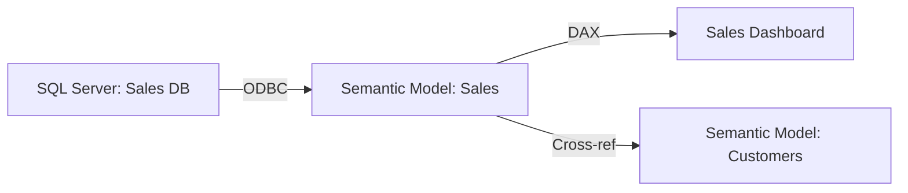

# Fabric Tenant Scanner — Prototype

**Status:** 🚀 PROTOTYPE v0.1  
**Purpose:** Discover and analyze Fabric tenant artifacts (workspaces, semantic models, reports, dependencies)  
**Language:** Python 3.9+  
**Dependencies:** `azure-identity`, `requests`, `pyodbc`, `pyyaml`, `pydantic`

---

## Overview

The Fabric Tenant Scanner is a multi-module Python tool that:

1. **Discovers** all workspaces, items, and semantic models across a Fabric tenant
2. **Analyzes** Semantic Model definitions (TMDL/BIM) to extract metadata and DAX formulas
3. **Maps** dependencies: Model → Report, Model → Data Source, Cross-model references
4. **Traces** full data lineage from source systems through transforms to BI consumption
5. **Generates** structured output (JSON, Markdown, Mermaid diagrams)

---

## Architecture

```
┌─────────────────────────────────────────────────────────────┐
│ Fabric Tenant Scanner                                        │
├─────────────────────────────────────────────────────────────┤
│                                                              │
│  ┌──────────────────┐  ┌──────────────────┐                │
│  │ TenantDiscoverer │  │  WorkspaceScanner │                │
│  │ (REST API)       │  │  (REST API)       │                │
│  └────────┬─────────┘  └────────┬─────────┘                │
│           │                     │                            │
│           └──────────┬──────────┘                            │
│                      ▼                                       │
│           ┌────────────────────┐                            │
│           │ ArtifactEnumerator │                            │
│           │ • Workspaces       │                            │
│           │ • Semantic Models  │                            │
│           │ • Reports          │                            │
│           │ • Data Sources     │                            │
│           └────────┬───────────┘                            │
│                    │                                        │
│      ┌─────────────┼─────────────┐                          │
│      │             │             │                          │
│      ▼             ▼             ▼                          │
│   ┌──────┐   ┌──────────┐  ┌──────────┐                    │
│   │TMDL  │   │Power     │  │DAX       │                    │
│   │Parser│   │Query     │  │Analyzer  │                    │
│   │      │   │Parser    │  │          │                    │
│   └──────┘   └──────────┘  └──────────┘                    │
│      │             │             │                          │
│      └─────────────┼─────────────┘                          │
│                    ▼                                        │
│           ┌────────────────────┐                            │
│           │ DependencyMapper   │                            │
│           │ • Build graphs     │                            │
│           │ • Cross-refs       │                            │
│           │ • Impact analysis  │                            │
│           └────────┬───────────┘                            │
│                    │                                        │
│      ┌─────────────┼─────────────┐                          │
│      ▼             ▼             ▼                          │
│   ┌──────┐   ┌──────────┐  ┌──────────┐                    │
│   │JSON  │   │Markdown  │  │Mermaid   │                    │
│   │Export│   │Export    │  │Diagrams  │                    │
│   └──────┘   └──────────┘  └──────────┘                    │
│                                                              │
└─────────────────────────────────────────────────────────────┘
```

---

## Module Breakdown

### 1. **Core Scanner** (`scanner.py`)
Main orchestrator that:
- Initializes Azure authentication
- Orchestrates discovery workflow
- Manages artifact inventory
- Produces final output

### 2. **Tenant Discoverer** (`tenant_discoverer.py`)
REST API client to:
- List all workspaces
- Filter by capacity/admin
- Extract workspace metadata

### 3. **Artifact Enumerator** (`artifact_enumerator.py`)
Enumerates workspace contents:
- Semantic Models (Datasets)
- Reports
- Warehouses
- Lakehouses
- Dataflows
- Pipelines

### 4. **TMDL/BIM Parser** (`tmdl_parser.py`)
Extracts from semantic model files:
- Table definitions
- Column metadata
- Relationships and cardinality
- Data source bindings
- Calculated tables and columns

### 5. **DAX Analyzer** (`dax_analyzer.py`)
Analyzes DAX formulas:
- Extract measures and KPIs
- Identify column references
- Map table dependencies
- Flag complex/risky patterns

### 6. **Power Query Parser** (`power_query_parser.py`)
Extracts from Power Query (M):
- Data source connections
- Applied steps
- Source table mappings
- Connection strings (anonymized)

### 7. **Dependency Mapper** (`dependency_mapper.py`)
Builds dependency graphs:
- Semantic Model → Report
- Semantic Model → Data Source
- Semantic Model → External Model references
- Data Source → Consuming Models
- Impact radius calculation

### 8. **Output Formatters** (`output_formatters.py`)
Generates structured output:
- JSON inventory
- Markdown reports
- Mermaid diagrams
- CSV dependency tables

---

## Quick Start

### Prerequisites
```bash
pip install azure-identity requests pyyaml pydantic
```

### Basic Usage

```python
from fabric_scanner import FabricTenantScanner

# Initialize with Azure credentials (uses DefaultAzureCredential)
scanner = FabricTenantScanner(tenant_id="<tenant-id>")

# Discover all workspaces
workspaces = scanner.discover_workspaces()
print(f"Found {len(workspaces)} workspaces")

# Scan a specific workspace for semantic models
workspace_id = workspaces[0]['id']
models = scanner.enumerate_semantic_models(workspace_id)
print(f"Found {len(models)} semantic models")

# Analyze dependencies
dependencies = scanner.map_dependencies(workspace_id)
print(f"Dependency graph: {dependencies}")

# Generate output
scanner.export_to_json(output_path="./tenant-inventory.json")
scanner.export_to_markdown(output_path="./tenant-report.md")
scanner.export_lineage_diagram(output_path="./lineage.mermaid")
```

---

## Output Formats

### 1. **JSON Inventory** (`tenant-inventory.json`)
```json
{
  "tenant_id": "...",
  "scan_timestamp": "2026-04-01T...",
  "workspaces": [
    {
      "id": "...",
      "name": "Analytics",
      "semantic_models": [
        {
          "id": "...",
          "name": "Sales Model",
          "tables": [...],
          "relationships": [...],
          "data_sources": [...]
        }
      ],
      "reports": [...]
    }
  ],
  "dependencies": [...]
}
```

### 2. **Markdown Report** (`tenant-report.md`)
- Executive summary (# of workspaces, models, reports)
- Per-workspace inventory
- Unused models, orphaned reports
- Data source audit trail

### 3. **Mermaid Lineage Diagram** (`lineage.mermaid`)


### 4. **Dependency Table** (`dependencies.csv`)
```
source_type,source_name,target_type,target_name,dependency_type
SemanticModel,Sales,Report,Dashboard,consumer
DataSource,SQLServer:SalesDB,SemanticModel,Sales,feeder
SemanticModel,Sales,SemanticModel,Customers,cross_ref
```

---

## Configuration

Create `scanner-config.yaml`:

```yaml
tenant:
  tenant_id: "xxxxxxxx-xxxx-xxxx-xxxx-xxxxxxxxxxxx"
  environment: "production"  # or "test", "dev"

discovery:
  include_workspaces: []  # Leave empty = all; specify names to filter
  exclude_workspaces: ["Archive", "Sandbox"]
  
analysis:
  parse_dax: true
  parse_power_query: true
  trace_lineage: true
  
output:
  formats: ["json", "markdown", "mermaid"]
  directory: "./output"
  include_metadata: true

security:
  anonymize_connections: true
  exclude_credentials: true
```

---

## Next Steps

- [ ] Implement REST API client (Fabric Admin API)
- [ ] Implement TMDL/BIM parser
- [ ] Implement dependency mapper
- [ ] Add Power Query M parser
- [ ] Add DAX analyzer
- [ ] Add output formatters
- [ ] Add test coverage
- [ ] Add integration with FabricAdmin agent

---

## References

- [Fabric REST API Docs](https://learn.microsoft.com/en-us/rest/api/fabric/core/workspaces)
- [TMDL Reference](https://learn.microsoft.com/en-us/analysis-services/tmdl/tmdl-overview)
- [Power Query M Formula Reference](https://learn.microsoft.com/en-us/powerquery-m/)
- [DAX Function Reference](https://learn.microsoft.com/en-us/dax/dax-function-reference)

