# Fabric Tenant Dependency Graph — Mermaid Visualization

**Generated:** 2026-04-01  
**Source:** Fabric Tenant Scan Results  
**Purpose:** Visual representation of semantic model and report dependencies

---

## 📊 Complete Dependency Graph

Below is the complete Mermaid diagram showing all workspaces, semantic models, and reports with their relationships:

```mermaid
graph TD
    classDef Workspace fill:#9013FE,stroke:#5D0CA3,stroke-width:3px,color:#fff
    classDef SemanticModel fill:#4A90E2,stroke:#2E5C8A,stroke-width:2px,color:#fff
    classDef Report fill:#50E3C2,stroke:#2D8B7A,stroke-width:2px,color:#fff
    classDef DataSource fill:#F5A623,stroke:#8B6914,stroke-width:2px,color:#fff
    classDef Empty fill:#E8E8E8,stroke:#999999,stroke-width:1px,color:#333

    ws_00000008["My workspace<br/>(0 models, 0 reports)"]:::Empty
    ws_0000001a["Main<br/>(11 models, 5 reports)"]:::Workspace
    ws_00000007["StreamingDemo<br/>(1 models, 0 reports)"]:::Workspace
    ws_00000018["FUAM Capacity Metrics<br/>(1 models, 1 reports)"]:::Workspace
    ws_00000004["FUAM<br/>(5 models, 5 reports)"]:::Workspace
    ws_00000010["demoAgentCreatedWorkspace<br/>(1 models, 0 reports)"]:::Workspace
    ws_0000000d["AnalyticsAgentsCreated-ws-analytics-landing<br/>(0 models, 0 reports)"]:::Empty
    ws_0000000e["AnalyticsAgentsCreated-ws-analytics-persist<br/>(0 models, 0 reports)"]:::Empty
    ws_00000019["AnalyticsAgentsCreated-ws-analytics-meta<br/>(0 models, 0 reports)"]:::Empty
    ws_00000015["AnalyticsAgentsCreated-ws-analytics-present<br/>(0 models, 0 reports)"]:::Empty

    m_00000027["DataflowsStagingWarehouse<br/><sub>(Model)</sub>"]:::SemanticModel
    ws_0000001a --> m_00000027
    m_0000001f["EventHistoryDemo<br/><sub>(Model)</sub>"]:::SemanticModel
    ws_0000001a --> m_0000001f
    m_00000022["SM_ExternalMirror<br/><sub>(Model)</sub>"]:::SemanticModel
    ws_0000001a --> m_00000022
    m_00000026["SM_ExternalMirror_Optimized<br/><sub>(Model)</sub>"]:::SemanticModel
    ws_0000001a --> m_00000026
    m_00000001["SwissRailwayVisitors<br/><sub>(Model)</sub>"]:::SemanticModel
    ws_0000001a --> m_00000001
    m_00000003["SM_SalesOverview<br/><sub>(Model)</sub>"]:::SemanticModel
    ws_0000001a --> m_00000003
    m_00000024["SM_CustomerAnalytics<br/><sub>(Model)</sub>"]:::SemanticModel
    ws_0000001a --> m_00000024
    m_0000001c["SM_SupplierPerformance<br/><sub>(Model)</sub>"]:::SemanticModel
    ws_0000001a --> m_0000001c
    m_00000023["SM_ExternalMirror_Consolidated<br/><sub>(Model)</sub>"]:::SemanticModel
    ws_0000001a --> m_00000023
    m_00000014["SM_GeographicSalesAnalysis<br/><sub>(Model)</sub>"]:::SemanticModel
    ws_0000001a --> m_00000014
    m_00000002["SM_ExternalMirror_Complete<br/><sub>(Model)</sub>"]:::SemanticModel
    ws_0000001a --> m_00000002
    m_00000012["NearRealtimeSemanticModel<br/><sub>(Model)</sub>"]:::SemanticModel
    ws_00000007 --> m_00000012
    m_00000025["Fabric Capacity Metrics<br/><sub>(Model)</sub>"]:::SemanticModel
    ws_00000018 --> m_00000025
    m_00000011["FUAM_Item_SM<br/><sub>(Model)</sub>"]:::SemanticModel
    ws_00000004 --> m_00000011
    m_0000000f["FUAM_Core_SM<br/><sub>(Model)</sub>"]:::SemanticModel
    ws_00000004 --> m_0000000f
    m_0000000b["FUAM_Semantic_Model_Meta_Data_Analyzer_SM<br/><sub>(Model)</sub>"]:::SemanticModel
    ws_00000004 --> m_0000000b
    m_0000001b["FUAM_SQL_Endpoint_Analyzer_SM<br/><sub>(Model)</sub>"]:::SemanticModel
    ws_00000004 --> m_0000001b
    m_00000016["FUAM_Gateway_Monitoring_From_Files_SM<br/><sub>(Model)</sub>"]:::SemanticModel
    ws_00000004 --> m_00000016
    m_00000020["OrderAnalytics<br/><sub>(Model)</sub>"]:::SemanticModel
    ws_00000010 --> m_00000020

    r_0000001d["MyReportTest<br/><sub>(Report)</sub>"]:::Report
    ws_0000001a --> r_0000001d
    r_00000006["RefreshEveryMinute<br/><sub>(Report)</sub>"]:::Report
    ws_0000001a --> r_00000006
    r_00000021["Rep_ExternalMirror<br/><sub>(Report)</sub>"]:::Report
    ws_0000001a --> r_00000021
    r_00000028["SwissRailwayVisitors<br/><sub>(Report)</sub>"]:::Report
    ws_0000001a --> r_00000028
    r_00000017["Rep_ExternalMirror_2<br/><sub>(Report)</sub>"]:::Report
    ws_0000001a --> r_00000017
    r_0000000c["Fabric Capacity Metrics<br/><sub>(Report)</sub>"]:::Report
    ws_00000018 --> r_0000000c
    r_0000000a["FUAM_Item_Analyzer_Report<br/><sub>(Report)</sub>"]:::Report
    ws_00000004 --> r_0000000a
    r_00000013["FUAM_Core_Report<br/><sub>(Report)</sub>"]:::Report
    ws_00000004 --> r_00000013
    r_00000005["FUAM_Semantic_Model_Meta_Data_Analyzer_Report<br/><sub>(Report)</sub>"]:::Report
    ws_00000004 --> r_00000005
    r_00000009["FUAM_SQL_Endpoint_Analyzer_Report<br/><sub>(Report)</sub>"]:::Report
    ws_00000004 --> r_00000009
    r_0000001e["FUAM_Gateway_Monitoring_From_Files_Report<br/><sub>(Report)</sub>"]:::Report
    ws_00000004 --> r_0000001e

    m_00000027 -->|consumer| r_0000001d
    m_00000027 -->|consumer| r_00000006
    m_00000027 -->|consumer| r_00000021
    m_00000027 -->|consumer| r_00000028
    m_00000027 -->|consumer| r_00000017
    m_00000025 -->|consumer| r_0000000c
    m_00000011 -->|consumer| r_0000000a
    m_00000011 -->|consumer| r_00000013
    m_00000011 -->|consumer| r_00000005
    m_00000011 -->|consumer| r_00000009
    m_00000011 -->|consumer| r_0000001e
```

---

## 📋 Legend

| Color | Meaning |
|---|---|
| 🟣 Purple | Active Workspace (has models/reports) |
| 🟦 Light Gray | Empty Workspace (no models/reports) |
| 🔵 Blue | Semantic Model |
| 🟢 Green | Report |

---

## 🔗 Dependency Summary

### Model-to-Report Relationships

**DataflowsStagingWarehouse** (Main workspace)
- → MyReportTest
- → RefreshEveryMinute
- → Rep_ExternalMirror
- → SwissRailwayVisitors
- → Rep_ExternalMirror_2
- **Impact Radius:** 5 reports depend on this model

**FUAM_Item_SM** (FUAM workspace)
- → FUAM_Item_Analyzer_Report
- → FUAM_Core_Report
- → FUAM_Semantic_Model_Meta_Data_Analyzer_Report
- → FUAM_SQL_Endpoint_Analyzer_Report
- → FUAM_Gateway_Monitoring_From_Files_Report
- **Impact Radius:** 5 reports depend on this model

**Fabric Capacity Metrics** (FUAM Capacity Metrics workspace)
- → Fabric Capacity Metrics Report
- **Impact Radius:** 1 report depends on this model

---

## 🎯 Key Insights from Graph

### High-Impact Models
1. **DataflowsStagingWarehouse** — Powers 5 reports (45% of all reports in Main workspace)
   - ⚠️ Single point of failure for Main workspace reporting
   - Recommendation: Consider backup or redundancy

2. **FUAM_Item_SM** — Powers 5 reports (all FUAM administrative reports)
   - Powers entire FUAM workspace reporting
   - Critical for access management auditing

3. **Fabric Capacity Metrics** — Powers 1 report
   - Single use case

### Unused Models (No Consuming Reports)
- SM_ExternalMirror_Optimized
- SM_SalesOverview
- SM_CustomerAnalytics
- SM_SupplierPerformance
- SM_GeographicSalesAnalysis
- SM_ExternalMirror_Complete
- EventHistoryDemo
- NearRealtimeSemanticModel
- FUAM_Core_SM
- FUAM_Semantic_Model_Meta_Data_Analyzer_SM
- FUAM_SQL_Endpoint_Analyzer_SM
- FUAM_Gateway_Monitoring_From_Files_SM
- OrderAnalytics

**Status:** ⚠️ 13 models have no consuming reports
- **Possible reasons:**
  - Models in development
  - Models with embedded visuals (not in reports)
  - Unused/orphaned models
  - Models used by other semantic models (not detected at workspace level)

### Empty Workspaces
- AnalyticsAgentsCreated-ws-analytics-landing (L0)
- AnalyticsAgentsCreated-ws-analytics-persist (L1)
- AnalyticsAgentsCreated-ws-analytics-meta (Metadata)
- AnalyticsAgentsCreated-ws-analytics-present (L2)

**Status:** ⚠️ No connectivity in dependency graph (by design - still empty)

---

## 📈 Graph Statistics

| Metric | Value |
|---|---|
| Total Nodes | 30 (10 workspaces + 19 models + 11 reports) |
| Total Edges | 40 (30 workspace containment + 10 model consumption) |
| Models with Reports | 3 (out of 19) |
| Unused Models | 13 (68%) |
| Reports per Model | avg 0.58 |
| Models per Workspace | avg 1.9 |

---

## 💡 Observations

### Concentration Risk
- **DataflowsStagingWarehouse** is a critical hub with 5 dependent reports
- **FUAM_Item_SM** is the entire FUAM workspace reporting backbone
- **Risk:** Changes to these models affect multiple reports

### Potential Optimization
- 3 Snowflake Mirror variants exist but only 1 model is directly consumed by reports
  - Could consolidate to reduce maintenance burden
  - Or clarify the purpose of each variant

### Data Platform Scaffolding
- 4 agent-created workspaces are empty
- Designed for a layered architecture that hasn't been populated yet
- Decision needed: Keep for future use or delete?

---

## 🔍 Recommendations

1. **Document Unused Models**
   - 13 models don't directly feed reports
   - Determine if they're in development, embedded, or orphaned
   - Archive or delete if truly unused

2. **Reduce Concentration Risk**
   - DataflowsStagingWarehouse feeds 5 reports
   - Consider backup model or load balancing

3. **Consolidate Snowflake Variants**
   - 3 Mirror models exist; clarify purpose
   - Consolidate to single canonical model if possible

4. **Activate Data Platform**
   - 4 empty workspaces designed for layered architecture
   - Begin population or delete if no longer needed

5. **Full Column-Level Analysis**
   - This graph shows workspace/model/report relationships
   - Next phase: Export TMDL for column-level lineage
   - Will reveal dependencies between unused models

---

## 📁 Related Files

- **tenant-inventory.json** — Machine-readable inventory
- **tenant-report.md** — Human-readable scan summary
- **GOVERNANCE_ANALYSIS.md** — Detailed findings & recommendations
- **dependency-graph.mermaid** — This diagram (raw Mermaid code)

---

## 🚀 Next Steps

1. **View this diagram** in a Mermaid renderer:
   - GitHub (paste into .md file)
   - Mermaid Live Editor: https://mermaid.live
   - VS Code with Mermaid extension

2. **Export for presentations:**
   - Render as PNG/SVG for PowerPoint
   - Use for governance discussions

3. **Phase 2 Analysis:**
   - Export TMDL files for column-level lineage
   - Build detailed data flow diagrams
   - Identify cross-model dependencies

---

**Generated by:** Fabric Tenant Scanner v0.1  
**Date:** 2026-04-01  
**Source:** Fabric Tenant Scan Results

