# Main Workspace Dependency Graph (Simplified)

**Focus:** Main workspace (11 models, 5 reports)  
**Purpose:** Simplified view of primary analytics hub

```mermaid
graph TD
    classDef Model fill:#4A90E2,stroke:#2E5C8A,stroke-width:2px,color:#fff
    classDef HighImpact fill:#E74C3C,stroke:#C0392B,stroke-width:3px,color:#fff
    classDef Report fill:#50E3C2,stroke:#2D8B7A,stroke-width:2px,color:#fff
    classDef Unused fill:#BDC3C7,stroke:#95A5A6,stroke-width:1px,color:#333

    ws["Main Workspace<br/>(11 models, 5 reports)"]:::Model

    m_dfs["DataflowsStagingWarehouse"]:::HighImpact
    m_charity["EventHistoryDemo"]:::Unused
    m_snowflake["SM_ExternalMirror"]:::Model
    m_snowflake_ai["SM_ExternalMirror_Optimized"]:::Unused
    m_swiss["SwissRailwayVisitors"]:::Unused
    m_sales["SM_SalesOverview"]:::Unused
    m_customer["SM_CustomerAnalytics"]:::Unused
    m_supplier["SM_SupplierPerformance"]:::Unused
    m_snowflake_cons["SM_ExternalMirror_Consolidated"]:::Model
    m_geo["SM_GeographicSalesAnalysis"]:::Unused
    m_snowflake_complete["SM_ExternalMirror_Complete"]:::Unused

    r_test["MyReportTest"]:::Report
    r_refresh["RefreshEveryMinute"]:::Report
    r_snowflake_rep["Rep_ExternalMirror"]:::Report
    r_swiss_rep["SwissRailwayVisitors"]:::Report
    r_snowflake_rep2["Rep_ExternalMirror_2"]:::Report

    ws --> m_dfs
    ws --> m_charity
    ws --> m_snowflake
    ws --> m_snowflake_ai
    ws --> m_swiss
    ws --> m_sales
    ws --> m_customer
    ws --> m_supplier
    ws --> m_snowflake_cons
    ws --> m_geo
    ws --> m_snowflake_complete

    ws --> r_test
    ws --> r_refresh
    ws --> r_snowflake_rep
    ws --> r_swiss_rep
    ws --> r_snowflake_rep2

    m_dfs -->|consumer| r_test
    m_dfs -->|consumer| r_refresh
    m_dfs -->|consumer| r_snowflake_rep
    m_dfs -->|consumer| r_swiss_rep
    m_dfs -->|consumer| r_snowflake_rep2
```

---

## Key Findings

### 🔴 Critical Hub: DataflowsStagingWarehouse
- **Impact Radius:** 5 reports (100% of Main workspace reports)
- **Status:** Single point of failure
- **Risk Level:** 🔴 HIGH
- **Recommendation:** Review backup strategy or load balancing

### 🟢 Supporting Models
- **SM_ExternalMirror** — Snowflake data mirroring
- **SM_ExternalMirror_Consolidated** — Consolidated Snowflake data

### 🟡 Unused Models (13 models)
- EventHistoryDemo
- SM_ExternalMirror_Optimized
- SwissRailwayVisitors
- SM_SalesOverview
- SM_CustomerAnalytics
- SM_SupplierPerformance
- SM_GeographicSalesAnalysis
- SM_ExternalMirror_Complete
- (+ 5 FUAM models in other workspace)

**Action:** Investigate whether these are:
- In development?
- Embedded in Power BI (not via reports)?
- Orphaned/abandoned?

---

## 📊 Simplified Statistics

| Metric | Count |
|---|---|
| Workspaces | 1 (Main) |
| Models | 11 |
| Reports | 5 |
| Models with Consumers | 1 |
| Models without Consumers | 10 (91%) |
| Dependency Relationships | 5 |

